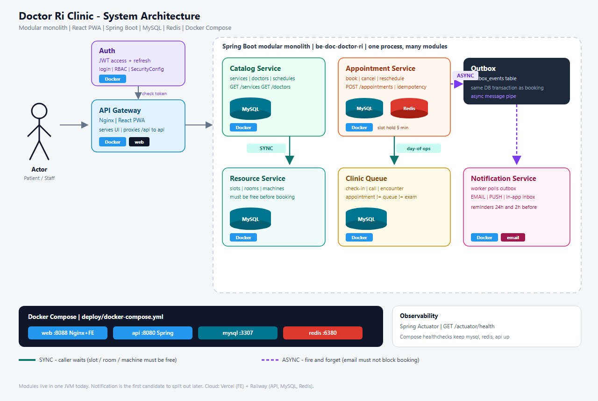

# Doctor Ri Clinic

A clinic web app for **Doctor Ri** — an obstetrics & gynecology practice in Vietnam. Patients book prenatal visits and ultrasounds online. Reception runs the waiting room. Doctors see who is next. The system refuses to double-book a doctor, a room, or an ultrasound machine.

This README is for **new developers**. Start with the diagram, then read each box until the words match the code.

Hands-on study path (files to open, exercises): [`developer-onboarding.md`](./developer-onboarding.md). Just run it: [Run it](#8-run-it).

---

## Table of contents

1. [The architecture diagram](#1-the-architecture-diagram)
2. [What the diagram is teaching](#2-what-the-diagram-is-teaching)
3. [Walk through every box](#3-walk-through-every-box)
4. [Inside the dashed box: modular monolith](#4-inside-the-dashed-box-modular-monolith)
5. [A booking request, end to end](#5-a-booking-request-end-to-end)
6. [Concept encyclopedia](#6-concept-encyclopedia)
7. [What’s inside this folder](#7-whats-inside-this-folder)
8. [Run it](#8-run-it)
9. [Where to read next](#9-where-to-read-next)

---

## 1. The architecture diagram

Read it **left to right**, then **top to bottom**.



What happens in one booking:

1. A **patient or staff member** opens the app.
2. **Nginx** is the only public door: it serves the React UI and forwards `/api` to Spring Boot.
3. **Auth** checks the JWT (who you are, what role you have).
4. The request lands in a specialist module: **Catalog**, **Appointment**, **Resource**, **Clinic Queue**, or **Notification**.
5. Before a booking is saved, Appointment asks **Resource** right now (**SYNC** — you wait).
6. After it is saved, Appointment writes an **Outbox** row. A worker sends email/push later (**ASYNC** — you do not wait).
7. **MySQL** is the source of truth. **Redis** holds a slot for 5 minutes so two people cannot grab the same second.
8. **Docker Compose** runs four containers: `web`, `api`, `mysql`, `redis`.
9. **Actuator** answers “is the API up?” at `/actuator/health`.

The dashed rectangle is one Java process (`be-doc-doctor-ri`), not five microservices. The boxes inside it are **modules** with walls.

---

## 2. What the diagram is teaching

Three ideas matter more than the colors.

### Idea 1 — Split by job, not by screens

| Box | Job in the clinic |
|-----|-------------------|
| Auth | Prove who you are |
| Catalog | What can I book, and which doctors do it? |
| Appointment | Create / cancel / reschedule the visit |
| Resource | Is this doctor, room, and machine still free? |
| Clinic Queue | Who is waiting *today*, and has the exam started? |
| Notification | Tell the human afterwards (email, push, inbox) |

### Idea 2 — Two kinds of talking

- **SYNC** (solid teal arrow): you **must wait**. You cannot confirm an appointment until the slot is free.
- **ASYNC** (dashed purple arrow): you **must not wait**. Sending email must not block the booking.

### Idea 3 — Ship boxes, not “it works on my laptop”

Blue **Docker** badges mean that piece runs in a container. Compose starts them together, restarts them if they die, and gives them names (`api`, `mysql`, `redis`) so they can find each other.

---

## 3. Walk through every box

Each subsection: **what**, **why**, **analogy**, **where in this repo**.

### Actor

**What:** Anyone using the app.

**Why:** Different people are allowed to do different things (**RBAC**).

**Analogy:** Visitors, reception, doctors, and admin walk in the same building through different doors.

| Who | URL area | Typical job |
|-----|----------|-------------|
| Patient | `/patient/*` | Book, cancel, see results |
| Reception | `/clinic/*` | Check-in, queue, walk-in |
| Doctor | `/doctor/*` | Queue, start/complete exam |
| Admin | `/admin/*` | Services, doctors, audit logs |

Code: `fe-doc-doctor-ri/src/app/router/AppRouter.tsx` (`ProtectedRoute` + `RoleRoute`).

### API Gateway (Nginx · React PWA)

**What:** The **only public entrance**. Browsers never talk to MySQL or to an internal module directly.

**Why:** One place to serve the UI, forward `/api`, and later add HTTPS or rate limits.

**Analogy:** Hospital reception. You do not walk in off the street into the ultrasound room.

**In this repo:**

- Docker: the `web` container. Nginx serves the built React app and proxies `/api/` → `api:8080` (`fe-doc-doctor-ri/nginx.conf`).
- Dev without Docker: Vite serves the UI and proxies `/api` → `http://localhost:8080`.
- Open the app at **http://localhost:8088** (Compose) or **http://127.0.0.1:5173** (Vite).

### Auth (JWT)

**What:** Login, tokens, and role checks. In the diagram it sits above the gateway because **every** later call depends on it.

**Why:** Catalog and Appointment must not each invent passwords.

**Analogy:** Security prints a visitor badge. Every department only checks the badge.

**Flow:**

1. `POST /api/v1/auth/login` with email + password.
2. Backend returns a **JWT access token** (2 hours) + **refresh token** (14 days).
3. Frontend stores them (`doctorri.auth` in `localStorage`) and sends `Authorization: Bearer <accessToken>` on every API call.
4. `SecurityConfig` validates the token **before** any protected controller runs.

Code: `be-doc-doctor-ri/.../auth/` and `shared/infrastructure/config/SecurityConfig.java`. Frontend: `features/auth/`, `shared/api/httpClient.ts`.

### Catalog Service (MySQL)

**What:** The list of medical services and doctors — “what can I book?”

**Why:** Booking needs a stable catalog: duration, buffers, whether ultrasound is required, which doctors offer which service.

**Analogy:** The clinic’s price list and doctor directory, not the appointment book.

**In this repo:** modules `servicecatalog` and `doctor`.

- Tables: `services`, `doctors`, `doctor_services`, `doctor_schedules`
- APIs: `GET /api/v1/services`, `GET /api/v1/doctors`
- Admin CRUD: `/api/v1/admin/services`, `/api/v1/admin/doctors`

Examples: first prenatal visit, fetal ultrasound, basic gynecology.

### Appointment Service (MySQL + Redis)

**What:** The transaction brain. “Create this visit.” This is the most important backend box.

**Why:** A booking must be all-or-nothing. You cannot save a half-created appointment.

**Analogy:** Writing the name in the appointment book — and locking the page so two receptionists cannot write on the same line.

**In this repo:** module `appointment`.

- `POST /api/v1/appointments` creates a booking
- **Idempotency-Key** header: double-click ≠ two appointments
- **Redis slot hold** (5 minutes, `SETNX`): first patient to grab `doctor + timestamp` wins
- MySQL stores `appointments` and status history

Code to read first: `AppointmentApplicationService`.

### Resource Service (MySQL) — SYNC

**What:** “Is this still available?” Appointment **waits** for the answer. The diagram labels this **SYNC**.

**Why:** Confirming a visit for a taken slot would double-book a doctor, a room, or an ultrasound machine.

**Analogy:** Calling the treatment room *while the patient is still at the counter*.

**In this repo:** modules `schedule` + `resource`.

| Question | Who answers |
|----------|-------------|
| Which clock times are free? | `SlotAvailabilityService` |
| Hold this doctor-minute for 5 minutes | `SlotHoldService` (Redis) |
| Reserve doctor + room type + ultrasound machine | `ResourceBookingService` |

These calls stay **inside the same JVM** (not HTTP). Same idea as a remote inventory service, without a network hop.

Rules (spec `04-booking-and-resource-rules.md`): always reserve the doctor; regular consult reserves a room *type*; ultrasound also reserves the machine; each service has `duration`, `buffer_before`, `buffer_after`.

### Clinic Queue (MySQL) — day-of ops

**What:** The live waiting line after the patient arrives. Not the calendar.

**Why:** “I have an appointment Tuesday 9am” is not the same as “I am standing at reception now.”

**Analogy:** The numbered tickets at the front desk.

New developers mix these three words up. Do not:

| Word | Meaning | Real-world |
|------|---------|------------|
| **Appointment** | A promise on the calendar | “Tuesday 9:00 ultrasound” |
| **Queue** | Who is waiting *right now* | Numbered ticket |
| **Encounter** | The exam that actually happened | Doctor started and finished |

**In this repo:** modules `clinic`, `queue`, `encounter`.

```text
Check-in  →  visit_queue status WAITING
Call      →  CALLED
Start exam → IN_SERVICE + Encounter created
Complete  →  COMPLETED
```

Code: `ClinicOperationsService`, `EncounterService`, pages `/clinic/queue` and `/doctor/queue`.

### Outbox (async message pipe)

**What:** A MySQL table `outbox_events`. Appointment writes a row in the **same transaction** as the booking.

**Why:** If you send email inside the booking request, a slow mailbox makes the UI hang. If you send email *after* commit with no record, a crash can lose the email. The outbox is the durable “please notify” note.

**Analogy:** Leaving a slip in the intern’s inbox instead of standing there until they finish printing.

This project does **not** run Kafka. The outbox table is that pipe for MVP. If notification volume grows, this is the first piece to extract (`doctor-ri-clinic-spec/10-system-architecture.md`).

### Notification Service

**What:** A worker that reads the outbox and delivers messages.

**Why:** SMTP and push providers are slow and flaky. Booking should succeed even if email is down for two minutes.

**In this repo:** module `notification`.

1. Worker (`NotificationOutboxProcessor`) polls `outbox_events`.
2. Sends **EMAIL** and **PUSH** (push is `STUB` locally, optional FCM in prod).
3. Fills the in-app inbox (`GET /api/v1/me/notifications`).
4. Schedules reminders **24h** and **2h** before the visit; cancel/reschedule removes pending reminders.

No clinical diagnosis in email or push bodies (spec `09-notification-design.md`).

### MySQL

**What:** Relational database. Permanent clinic data.

**Why:** Bookings need **ACID** — several writes succeed together or not at all (appointment + resource rows + outbox row).

**In this repo:** database `db_clinic`. Schema is versioned with **Flyway** (`V1__` … `V5__` under `be-doc-doctor-ri/src/main/resources/db/migration/`). Host port in Compose: **3307**.

### Redis

**What:** In-memory store. Fast, not the source of truth.

**Why:** Two patients clicking the same slot at the same second. Redis `SETNX` + TTL is the short lock; MySQL is the final record.

**In this repo:** slot holds and idempotency keys. Host port in Compose: **6380**. If Redis is down, booking fails — that is intentional.

### Docker Compose

**What:** One YAML file that starts the four containers and a private network.

**Why:** Same MySQL 8, Redis 7, JDK 20, and Nginx everywhere.

| Container | What it is | Host port |
|-----------|------------|-----------|
| `web` | Nginx + built React app | **8088** |
| `api` | Spring Boot | **8080** |
| `mysql` | MySQL 8 | **3307** |
| `redis` | Redis 7 | **6380** |

File: `deploy/docker-compose.yml`. Cloud today: **Vercel** (frontend) + **Railway** (API, MySQL, Redis). Compose DNS (`mysql`, `redis`, `api`) is the “phone book”; there is no Eureka.

### Observability (Actuator)

**What:** `GET /actuator/health` — is the API up?

**Why:** Compose waits for this before marking `api` healthy. You use it as a smoke test after deploy.

**In this repo:** Spring Actuator exposes `health` and `info`. Full Grafana / Prometheus / tracing is not deployed yet. Add it when you split processes and one user click hops across machines.

---

## 4. Inside the dashed box: modular monolith

> **One deployable app, many modules with walls.**  
> Not microservices (those are separate processes).  
> Not spaghetti (everything calling everything).

```text
com.doctorri.clinic
├── auth
├── servicecatalog
├── doctor
├── schedule
├── resource
├── appointment
├── clinic
├── queue
├── encounter
├── notification
├── obstetric
├── admin / audit
└── shared          ← security, Redis, errors, seed data
```

Each module follows **Clean Architecture**:

```text
presentation  →  application  →  domain  ←  infrastructure
   (HTTP)         (use cases)   (rules)      (MySQL, Redis)
```

**Domain** does not know about Spring, React, or SQL. That is why booking rules can be tested without Docker.

Frontend mirrors the same idea per feature: `domain` / `application` / `infrastructure` / `ui` under `fe-doc-doctor-ri/src/features/`.

---

## 5. A booking request, end to end

Follow this against the diagram.

```text
Patient in browser
        │
        ▼
  Nginx (web)                    ← API Gateway
        │  POST /api/v1/appointments
        │  Authorization: Bearer …
        │  Idempotency-Key: <uuid>
        ▼
  Spring Security                ← Auth
        ▼
  AppointmentApplicationService  ← Appointment Service
        │
        ├─ Redis slot hold (5 min)              ← Resource lock (SYNC)
        ├─ SQL: doctor / room / machine free    ← Resource check (SYNC)
        ├─ INSERT appointments
        └─ INSERT outbox_events                 ← Outbox (ASYNC)
        ▼
  200 OK back to the patient
        │
        └─ worker later sends email / push      ← Notification
```

After the patient arrives:

```text
Reception check-in  →  Clinic Queue (WAITING)
Doctor start-exam   →  Encounter + queue IN_SERVICE
Doctor complete     →  appointment + queue COMPLETED
```

---

## 6. Concept encyclopedia

Recognize these words when they show up in code. You do not need to memorize them.

### Frontend & HTTP

| Term | Meaning in this project |
|------|-------------------------|
| **Frontend** | React app in `fe-doc-doctor-ri`. Runs in the browser. |
| **Backend / API** | Spring Boot app in `be-doc-doctor-ri`. Speaks JSON over HTTP. |
| **REST** | `GET` reads, `POST` creates, `PUT`/`PATCH` updates, `DELETE` removes. |
| **Endpoint** | One URL + method, e.g. `POST /api/v1/appointments`. |
| **JSON** | Text format of request/response bodies. |
| **HTTP status** | `200` OK, `400` bad input, `401` not logged in, `403` wrong role, `409` conflict (slot taken). |
| **SPA** | Single Page App. Nginx always serves `index.html`; React Router picks the page. |
| **PWA** | Installable website (“Add to Home Screen”). |
| **Vite** | Frontend dev server + bundler. Proxies `/api` to the backend. |
| **TanStack Query** | Fetches, caches, and refetches API data. |
| **httpClient** | `src/shared/api/httpClient.ts` — attaches the JWT, handles 401. |

### Identity & security

| Term | Meaning in this project |
|------|-------------------------|
| **Authentication** | “Who are you?” — login. |
| **Authorization** | “Are you allowed?” — role check. |
| **JWT** | Signed token after login. The server does not store the session in memory. |
| **Access token** | Short-lived JWT (2 hours). Sent on every API call. |
| **Refresh token** | Longer-lived (14 days). Used to mint a new access token. |
| **Bearer token** | Header: `Authorization: Bearer <jwt>`. |
| **RBAC** | Role-Based Access Control. Roles: `PATIENT`, `RECEPTIONIST`, `NURSE`, `DOCTOR`, `CLINIC_ADMIN`, `SYSTEM_ADMIN`. |
| **CORS** | Browser rule: a page on `localhost:8088` may only call another origin if the API allows it (`CORS_ALLOWED_ORIGINS`). |
| **Password hash** | Passwords are never stored in plain text. |

### Data & consistency

| Term | Meaning in this project |
|------|-------------------------|
| **MySQL** | Relational database. Source of truth. |
| **Table / row** | Spreadsheet-like storage. Each booking is a row in `appointments`. |
| **Primary key** | Unique id of a row. |
| **Foreign key** | A column pointing at another table (`appointments.doctor_id` → `doctors`). |
| **ACID / transaction** | Several SQL writes succeed together or not at all. |
| **Flyway** | Versioned SQL files (`V1__…`). Never edit an old file that already ran in production. |
| **JPA / Entity** | Java class mapped to a table, e.g. `AppointmentEntity`. |
| **Redis** | In-memory store for slot holds and idempotency keys. |
| **TTL** | Time to live. A Redis hold expires after 5 minutes. |
| **SETNX** | “Set if not exists.” First patient to hold a slot wins. |
| **Idempotency** | Doing the same request twice has the same effect (`Idempotency-Key` header). |

### Communication styles

| Term | Meaning |
|------|---------|
| **Synchronous** | Caller waits. Slot check. HTTP from browser to API. |
| **Asynchronous** | Caller does not wait. Outbox → email. |
| **Outbox pattern** | Write the “please notify” event in the same DB transaction as the booking, then a worker sends it. |
| **Worker** | Background loop (`NotificationOutboxProcessor`). |

### Architecture styles

| Term | Meaning |
|------|---------|
| **Monolith** | One program does everything. |
| **Microservices** | Many programs, each a specialist, talking over the network. |
| **Modular monolith** | One program, internal modules with boundaries (**this repo**). |
| **Clean Architecture** | Domain in the center; frameworks at the edges. |
| **Use case / application service** | One class that orchestrates a business action. |
| **DTO** | JSON shape for the API, not the DB entity. |
| **ADR** | Architecture Decision Record — why we chose this shape. |

### Containers & cloud

| Term | Meaning |
|------|---------|
| **Image** | Frozen filesystem + start command. |
| **Container** | A running image. |
| **Docker Compose** | YAML that starts several containers and a network. |
| **Healthcheck** | Periodic “are you alive?” Compose waits for MySQL/Redis/API. |
| **Reverse proxy** | Nginx: public HTTP in, UI or `/api` out. |
| **Environment variable** | Config at runtime (`MYSQL_HOST`, `JWT_SECRET`). Never commit real secrets. |

### Clinic domain

| Term | Meaning |
|------|---------|
| **Slot** | A bookable start time for a doctor + service + date. |
| **Buffer before/after** | Extra reserved minutes so back-to-back visits do not collide. |
| **Resource booking** | Reservation of doctor time, room type, and (for ultrasound) a machine. |
| **Walk-in** | Patient with no prior online appointment. |
| **Operational status** | Floor state (`CHECKED_IN`, …), separate from booking status (`CONFIRMED`). |
| **Audit log** | Who did what (staff actions). |
| **MVP** | First useful version. No online payment, no full EMR, no telemedicine. |

### Observability

| Term | Meaning |
|------|---------|
| **Log** | A timestamped line of text. |
| **Metric** | A number over time (requests/second). |
| **Trace** | One request’s path across services. |
| **Actuator** | Spring’s ops endpoints. We expose `health` and `info`. |

---

## 7. What’s inside this folder

This workspace is **not one git repo**. It is a folder of three repos plus deploy files.

```text
doctor/
├── README.md                    ← you are here
├── developer-onboarding.md      ← study path + file-by-file guide
├── notes.md                     ← short project map
├── run.md                       ← copy-paste run commands
├── doctor-ri-clinic-spec/       ← WHAT to build (business + API + DB)
├── be-doc-doctor-ri/            ← HOW the API works (Java / Spring Boot)
├── fe-doc-doctor-ri/            ← HOW the UI works (React / TypeScript)
├── deploy/                      ← Docker Compose + Railway/Vercel notes
└── docs/architecture.png        ← the diagram above
```

**Rule of thumb:** confused about *behavior* → spec. Confused about *implementation* → code.

---

## 8. Run it

From `deploy/` (Docker runs MySQL, Redis, API, and the UI):

```powershell
cd "d:\Personal Projects\New\doctor\deploy"
Copy-Item .env.example .env
docker compose up -d --build
```

Open **http://localhost:8088**

| Email | Password | Role |
|-------|----------|------|
| `mebau@doctorri.local` | `Password123!` | Patient |
| `receptionist@doctorri.local` | `Password123!` | Reception |
| `doctor.ri@doctorri.local` | `Password123!` | Doctor |
| `admin@doctorri.local` | `Password123!` | Admin |

Health check: http://localhost:8080/actuator/health

More detail: [`run.md`](./run.md), [`deploy/LOCAL.md`](./deploy/LOCAL.md).

---

## 9. Where to read next

| If you want… | Open |
|--------------|------|
| To learn by doing, file by file | [`developer-onboarding.md`](./developer-onboarding.md) |
| Product rules (booking, queue, permissions) | [`doctor-ri-clinic-spec/`](./doctor-ri-clinic-spec/) |
| Why modular monolith | [`be-doc-doctor-ri/docs/adr/001-clean-architecture-modular-monolith.md`](./be-doc-doctor-ri/docs/adr/001-clean-architecture-modular-monolith.md) |
| Frontend feature folders | [`fe-doc-doctor-ri/docs/adr/001-feature-clean-architecture.md`](./fe-doc-doctor-ri/docs/adr/001-feature-clean-architecture.md) |
| Notification / outbox design | [`doctor-ri-clinic-spec/09-notification-design.md`](./doctor-ri-clinic-spec/09-notification-design.md) |
| When to split a service later | [`doctor-ri-clinic-spec/10-system-architecture.md`](./doctor-ri-clinic-spec/10-system-architecture.md) |

---

A user hits **Nginx**. **JWT** proves who they are. **Catalog** is the service list. **Appointment** writes the visit. **Resource** is checked **synchronously**. **Outbox + Notification** run **asynchronously**. **Clinic Queue** is the waiting room after check-in. **Docker Compose** runs the four containers. **Actuator** is the health light.
