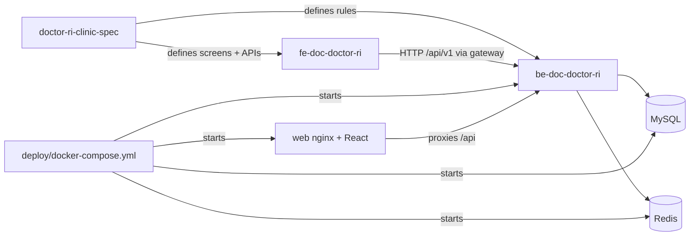
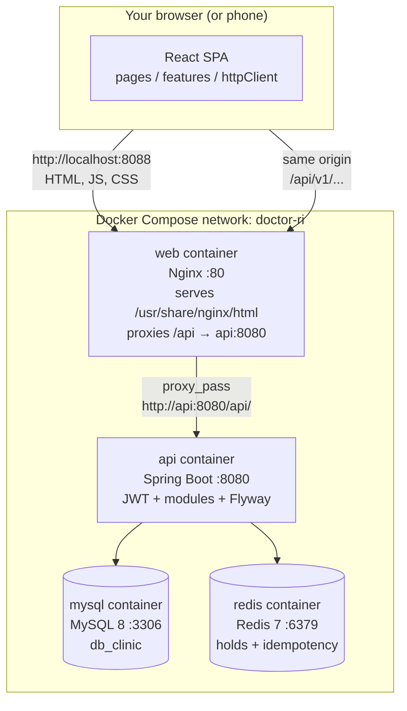
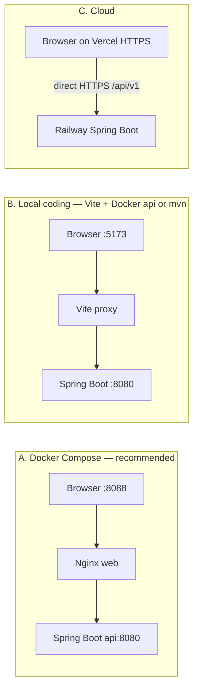
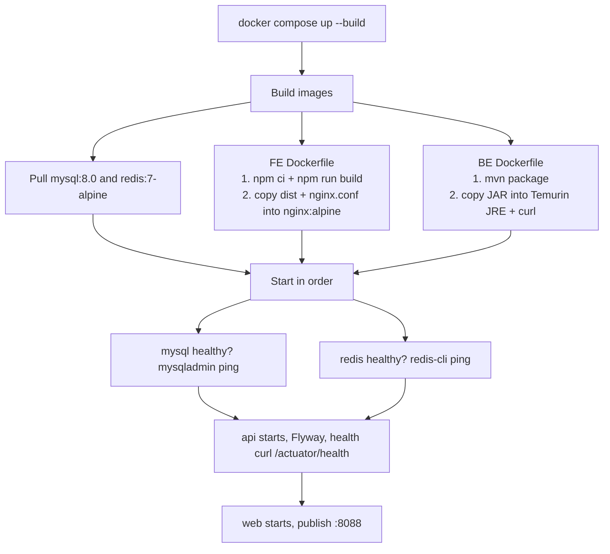
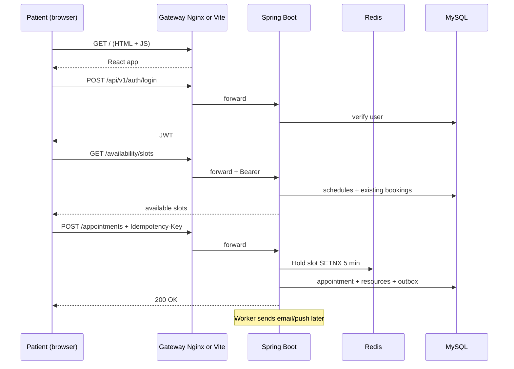
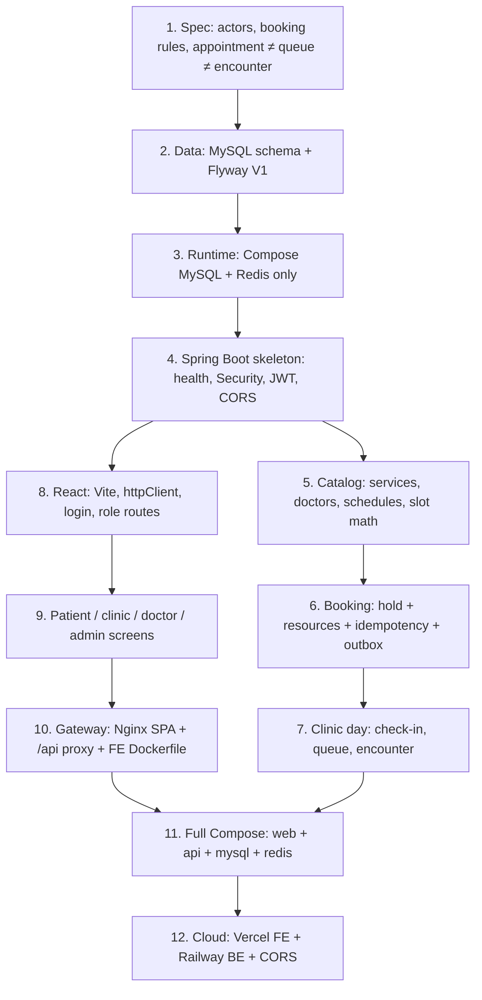

# Doctor Ri Clinic — Developer Onboarding Guide

> **Who this is for:** You are a new developer with minimum experience. You want to *understand* this product deeply — not just run it — by learning how the business works, how the code is organized, and how **browser → React → API gateway → Java backend → MySQL/Redis → Docker** fit together.

> **How to use this doc:** Read in order. Do not skip Part 2 (business). Code without business context will feel random. After each part, do the **Try it yourself** box before moving on.

---

## Table of contents

1. [Start here: run the app](#1-start-here-run-the-app)
2. [What problem does this product solve?](#2-what-problem-does-this-product-solve)
3. [The most important idea: three different “things”](#3-the-most-important-idea-three-different-things)
4. [Who uses the system? (Actors & roles)](#4-who-uses-the-system-actors--roles)
5. [How the workspace is organized](#5-how-the-workspace-is-organized)
6. [Tech stack in plain English](#6-tech-stack-in-plain-english)
7. [Architecture: the full stack, every hop](#7-architecture-the-full-stack-every-hop)
8. [Backend module guide (Java)](#8-backend-module-guide-java)
9. [Frontend module guide (React)](#9-frontend-module-guide-react)
10. [End-to-end flows you must understand](#10-end-to-end-flows-you-must-understand)
11. [Database & domain model](#11-database--domain-model)
12. [Patterns used in this project](#12-patterns-used-in-this-project)
13. [Build this project from scratch](#13-build-this-project-from-scratch)
14. [Suggested learning path (4 weeks)](#14-suggested-learning-path-4-weeks)
15. [Hands-on exercises](#15-hands-on-exercises)
16. [Glossary](#16-glossary)
17. [Where to read next](#17-where-to-read-next)

---

## 1. Start here: run the app

Before reading code, **see the product work**.

```powershell
cd "d:\Personal Projects\New\doctor\deploy"
Copy-Item .env.example .env
docker compose up -d --build
```

That one command starts **four containers**: Nginx + React (`web`), Spring Boot (`api`), MySQL (`mysql`), Redis (`redis`). Open **http://localhost:8088** and log in with:

| Email | Password | You play as |
|-------|----------|-------------|
| `mebau@doctorri.local` | `Password123!` | Pregnant patient |
| `receptionist@doctorri.local` | `Password123!` | Front desk |
| `doctor.ri@doctorri.local` | `Password123!` | Doctor |
| `admin@doctorri.local` | `Password123!` | Clinic admin |

**Try it yourself (15 min):**

1. As **patient**: browse services → book an appointment → view it in “My appointments”
2. As **receptionist**: open clinic queue → check in that patient
3. As **doctor**: open your queue → start exam → complete exam
4. As **admin**: look at services and doctors list

Write down what surprised you. That list becomes your learning checklist.

More run options (Vite hot-reload, backend-only): [`run.md`](./run.md).

---

## 2. What problem does this product solve?

**Doctor Ri Clinic** is software for a real-world OB/GYN clinic (Sản khoa / Phụ khoa) in Vietnam.

### The clinic needs to:

- Let **pregnant patients** book prenatal visits and ultrasounds online
- Avoid **double-booking** the same doctor, room, or ultrasound machine
- Run the **waiting room** when patients arrive (check-in, call numbers, assign rooms)
- Let **doctors** see who is waiting and record that an exam happened
- Send **reminders** (24h and 2h before appointment)
- Keep an **audit trail** of staff actions

### What MVP does NOT do (yet)

- Online payment
- Full electronic medical records (EMR)
- Insurance
- Telemedicine

**Source of truth for business rules:** `doctor-ri-clinic-spec/` folder (15 markdown files).

---

## 3. The most important idea: three different “things”

New developers often confuse these. This project **intentionally separates** them:

| Concept | What it means | Real-world analogy |
|---------|---------------|-------------------|
| **Appointment** | A *planned* visit at a specific time | “I have an appointment Tuesday 9am” |
| **Queue** | *Who is waiting right now* at the clinic today | The numbered tickets at reception |
| **Encounter** | The *actual exam* that happened | Doctor opens chart, examines, closes chart |

```
Appointment  =  promise on the calendar
Queue        =  live waiting line after check-in
Encounter    =  the medical visit itself
```

**Why separate?**

- Patient books online → **Appointment** exists, but they are not “in queue” yet
- Patient arrives → reception **check-in** → **Queue** entry created
- Doctor starts exam → **Encounter** begins → queue moves to “in service”

If you remember only one thing from this guide: **booking ≠ waiting ≠ examining**.

---

## 4. Who uses the system? (Actors & roles)

| Role | Code constant | Frontend area | Main jobs |
|------|---------------|---------------|-----------|
| Patient (mẹ bầu) | `PATIENT` | `/patient/*` | Book, cancel, view results, notifications |
| Receptionist | `RECEPTIONIST` | `/clinic/*` | Check-in, walk-in, queue, assign room |
| Nurse | `NURSE` | `/clinic/*` | Same clinic portal as reception |
| Doctor | `DOCTOR` | `/doctor/*` | Schedule, queue, start/complete exam |
| Clinic admin | `CLINIC_ADMIN` | `/admin/*` | Manage services, doctors, schedules |
| System admin | `SYSTEM_ADMIN` | `/admin/*` | Same as clinic admin + system scope |

**RBAC** = Role-Based Access Control. The backend checks JWT role on every protected API. The frontend uses `RoleRoute` to hide pages you cannot access.

Read full permission matrix: `doctor-ri-clinic-spec/02-actors-and-permissions.md`

---

## 5. How the workspace is organized

This folder is **not one git repo**. It is a **workspace** containing 3 independent repos + deploy tooling:

```
doctor/
├── doctor-ri-clinic-spec/   ← WHAT to build (specs, API design, DB design)
├── be-doc-doctor-ri/        ← HOW backend works (Java / Spring Boot)
├── fe-doc-doctor-ri/        ← HOW frontend works (React / TypeScript)
├── deploy/                  ← Run everything with Docker Compose
├── docs/                    ← Architecture diagram (architecture.png / .svg)
├── scripts/                 ← GitNexus AI indexing
├── notes.md                 ← Project overview (quick reference)
├── run.md                   ← Quick run commands
├── README.md                ← Short architecture walkthrough + diagram
└── developer-onboarding.md  ← This file (deep study path)
```

### How the three repos relate



**Rule:** When unsure about *behavior*, read the spec first. When unsure about *implementation*, read the code.

---

## 6. Tech stack in plain English

| Layer | Technology | What it does |
|-------|------------|--------------|
| **Frontend** | React 18 + TypeScript | UI in the browser; PWA for mobile |
| **Build tool (FE, local)** | Vite | Dev server + bundler; **proxies `/api` → backend** |
| **API gateway (Docker)** | Nginx in the `web` container | Serves the built React app; **proxies `/api` → Spring Boot** |
| **Backend** | Spring Boot 3.4 (Java 20) | REST API, business logic, security |
| **Database** | MySQL 8 | Permanent data (patients, appointments, etc.) |
| **Cache / locks** | Redis 7 | Short-lived slot holds + idempotency keys |
| **Migrations** | Flyway | SQL version control for database schema |
| **Auth** | JWT (access + refresh tokens) | Proves who you are on each request |
| **Notifications** | Outbox + worker | Reliable email/push after DB commit |
| **Deploy (local)** | Docker Compose | Runs MySQL + Redis + BE + FE together |

There is **no Spring Cloud Gateway, Kong, or AWS API Gateway**. Nginx (Docker) or Vite (local FE) is the public door.

### Concepts to learn if you are new

| Concept | Learn enough to… |
|---------|------------------|
| **HTTP / REST** | Understand GET vs POST, status codes, JSON body |
| **JWT** | Know access token goes in `Authorization: Bearer …` header |
| **SQL** | Read tables, JOINs, understand Flyway migrations |
| **React hooks** | Read `useState`, `useEffect`, TanStack Query `useQuery` |
| **Reverse proxy** | Browser talks to one origin; Nginx/Vite forwards `/api` internally |
| **Docker** | Image vs container, Compose network names, published ports |
| **Async** | Frontend `fetch` → gateway → backend → database → response |

---

## 7. Architecture: the full stack, every hop

This section is the map of the whole product. If you can draw it from memory, you can build it from scratch.

### 7.1 What actually runs (physical architecture)

Four processes. That is the entire local product.



**Host ports** (your Windows machine → container):

| You open / connect | Container | Inside Docker | Job |
|--------------------|-----------|---------------|-----|
| **http://localhost:8088** | `web` | `:80` | Public entrance: UI + `/api` proxy |
| http://localhost:8080 | `api` | `:8080` | Spring Boot (also reachable directly) |
| `localhost:3307` | `mysql` | `:3306` | Database (offset so it does not clash with a local MySQL) |
| `localhost:6380` | `redis` | `:6379` | Cache / locks |

Inside Docker, containers talk by **service name**, not `localhost`:

- Spring Boot uses `MYSQL_HOST=mysql` and `REDIS_HOST=redis`
- Nginx uses `proxy_pass http://api:8080`

`localhost` inside a container means *that container*, not your laptop. Compose DNS is the phone book.

### 7.2 What each part does (job description)

Read this table until each row is obvious.

| Piece | Lives in | Job | Analogy |
|-------|----------|-----|---------|
| **React frontend** | Browser (JS downloaded from `web`) | Draw screens, collect clicks, call APIs, store JWT in `localStorage` | The clinic website / kiosk UI |
| **Vite** (dev only) | Your machine, port 5173 | Hot-reload React; **proxy `/api` → `:8080`** | A temporary reception desk while you code |
| **Nginx** (Docker / prod-like) | `web` container | Serve static files; SPA fallback to `index.html`; **proxy `/api/` to Spring Boot** | The real reception: one public door |
| **Spring Boot** | `api` container | Auth, booking rules, queue, exams, notifications | The clinic’s back office |
| **Spring Security + JWT filter** | Inside `api` | Reject unauthenticated / wrong-role requests *before* controllers | Security checking the visitor badge |
| **MySQL** | `mysql` container | Source of truth: users, appointments, queue, outbox | The paper appointment book + charts |
| **Redis** | `redis` container | 5-minute slot holds + 24h idempotency keys | A sticky note: “this minute is taken” |
| **Flyway** | Runs inside `api` on startup | Apply `V1__`…`V5__` SQL so schema matches code | Version control for tables |
| **Outbox worker** | Thread inside `api` | Poll `outbox_events`, send email/push later | Intern who sends reminders after the booking is saved |
| **Docker Compose** | `deploy/docker-compose.yml` | Build images, start 4 containers, healthchecks, private network, volumes | The building that houses all rooms |
| **Actuator** | `GET /actuator/health` | “Is the API up?” Compose waits for this | A pulse check |

**Important:** browsers never talk to MySQL or Redis. Only Spring Boot does.

### 7.3 The API gateway (Nginx) — what it is and is not

In this project **the API gateway is Nginx**, bundled in the frontend Docker image.

File: `fe-doc-doctor-ri/nginx.conf`

```
Browser  →  Nginx :80
              ├─ GET /                 → static files (React build)
              ├─ GET /patient/book     → still index.html (SPA fallback)
              └─ /api/*                → http://api:8080/api/*
```

What Nginx **does**:

1. **Serves the UI** from `/usr/share/nginx/html` (the Vite `dist/` folder copied into the image).
2. **SPA fallback:** unknown paths like `/patient/book` return `index.html` so React Router can handle them.
3. **Reverse-proxies `/api/`** to Spring Boot so the browser stays on **one origin** (`localhost:8088`). No CORS fight in Docker.
4. Forwards `Host`, `X-Real-IP`, `X-Forwarded-For` so the backend knows the client.

What Nginx **does not** do:

- It does **not** check JWT (Spring Security does).
- It does **not** run booking logic.
- It is **not** Spring Cloud Gateway / Kong / AWS API Gateway.

**Same-origin trick:** the React app is built with `VITE_API_BASE_URL=/api/v1`. `fetch('/api/v1/appointments')` hits the **same host** the page came from. Nginx then forwards it. Phone on Wi-Fi only needs `http://<your-PC-IP>:8088`.

### 7.4 Three ways a request travels (same app, different doors)

You will use all three. Memorize the difference.



| Mode | Who is the gateway? | Frontend URL | API the browser calls | CORS? |
|------|---------------------|--------------|------------------------|-------|
| **A. Docker** | Nginx | http://localhost:8088 | `/api/v1/...` (same origin) | Usually unused (same origin) |
| **B. Vite dev** | Vite `server.proxy` in `vite.config.ts` | http://127.0.0.1:5173 | `/api/...` → proxied to `localhost:8080` | Backend allows `localhost:5173` |
| **C. Cloud** | None in front (or Vercel itself for static) | `https://….vercel.app` | `VITE_API_BASE_URL=https://<be>/api/v1` | **Required** — set `CORS_ALLOWED_ORIGINS` |

Vite proxy (dev):

```ts
// fe-doc-doctor-ri/vite.config.ts
server: {
  proxy: {
    '/api': { target: 'http://localhost:8080', changeOrigin: true },
  },
}
```

Cloud: there is no Nginx in front of the API. The built JS calls the Railway URL directly. That is why production **must** set CORS.

### 7.5 One click, hop by hop (login, then book)

Follow this with DevTools → Network while you click.

#### Step 0 — Load the app

```
Browser GET http://localhost:8088/
  → Nginx returns index.html
  → Browser loads /assets/*.js (React bundle)
  → main.tsx mounts AppProviders + AppRouter
  → No JWT in localStorage → you see login / landing
```

Files: `fe-doc-doctor-ri/src/main.tsx`, `src/app/router/AppRouter.tsx`, `fe-doc-doctor-ri/nginx.conf`.

#### Step 1 — Login

```
LoginForm submit
  → authApi.login()  POST /api/v1/auth/login  { email, password }
  → httpClient.ts fetch('/api/v1' + '/auth/login')   ← no Bearer yet
  → Nginx location /api/  → Spring Boot
  → SecurityConfig: /api/v1/auth/** is permitAll
  → AuthController → AuthService
       → look up users row, BCrypt check password
       → JwtService issues accessToken (2h) + refreshToken (14d)
  → JSON back to browser
  → setAuthSession() writes localStorage key doctorri.auth
  → RoleRoute sends PATIENT to /patient, DOCTOR to /doctor, …
```

#### Step 2 — Every later API call

```
httpClient.ts
  → reads accessToken from localStorage
  → adds header  Authorization: Bearer <jwt>
  → fetch http://localhost:8088/api/v1/...
  → Nginx → api:8080
  → JwtAuthenticationFilter parses JWT, puts role on SecurityContext
  → SecurityConfig checks URL vs role
       401 = missing/bad token   403 = wrong role
  → Controller → Application service → MySQL / Redis
  → JSON response
  → TanStack Query puts data in the UI
```

If the API returns **401**, `httpClient` clears the session and the user must log in again.

#### Step 3 — Book an appointment (the important path)

```
BookingPage
  GET  /api/v1/services
  GET  /api/v1/doctors
  GET  /api/v1/availability/slots?serviceId&doctorId&date
  POST /api/v1/appointments
       Header: Authorization: Bearer …
       Header: Idempotency-Key: <uuid>
       Body: service, doctor, start time, …

Inside Spring Boot (same JVM, not extra HTTP):
  AppointmentController
    → IdempotencyService          Redis: same key twice = same result
    → AppointmentApplicationService
         → BookingPolicy
         → SlotHoldService.hold() Redis SETNX 5 min  (SYNC — must succeed)
         → assert doctor/room/machine free in MySQL (SYNC)
         → INSERT appointments + resource_bookings + status history
         → INSERT outbox_events                    (ASYNC — do not wait)
  → 200 OK to browser
  → worker later: NotificationOutboxProcessor sends email/push
```

**SYNC vs ASYNC:** you wait for Redis + MySQL. You do **not** wait for email. If SMTP is down, the booking still exists; the worker retries.

### 7.6 Inside the React app (what the frontend is for)

The frontend **never** talks to MySQL. It only:

1. Renders routes per role (`AppRouter` + `ProtectedRoute` / `RoleRoute`)
2. Calls REST via feature `*Api.ts` files → `httpClient.ts`
3. Caches server data with TanStack Query
4. Stores the JWT session

```
pages (thin screens)
  → features/*/ui (components)
       → features/*/application (hooks)
            → features/*/domain (types, pure rules)
            → features/*/infrastructure (*Api.ts)
                 → shared/api/httpClient.ts
                      → GET/POST /api/v1/...
```

**Never** call `fetch` from a page. That rule exists so every request goes through JWT + error handling.

Entry: `src/main.tsx` → `AppProviders` (QueryClient, etc.) → `AppRouter`.

### 7.7 Inside Spring Boot (what the backend is for)

One Java process. **Modular monolith** — not microservices.

```
HTTP request
  → Tomcat (embedded in Spring Boot)
  → JwtAuthenticationFilter
  → SecurityFilterChain (RBAC)
  → @RestController in presentation/
       → application use case (orchestration)
            → domain rules (no Spring, no SQL)
            → infrastructure: JPA repositories, Redis, mail
  → JSON response
```

Startup of `api` (why the first boot is slow):

1. Container starts, waits until **MySQL and Redis healthchecks** pass (`depends_on: condition: service_healthy`)
2. `ClinicApplication.main` boots Spring
3. **Flyway** runs `V1`…`V5` against `db_clinic`
4. JPA `ddl-auto: validate` — schema must already match entities
5. Demo seeder creates the four login accounts if needed
6. `@EnableScheduling` starts the outbox worker
7. Actuator `/actuator/health` becomes UP → Compose marks `api` healthy → `web` is allowed to start

Config: `be-doc-doctor-ri/src/main/resources/application.yml`  
Security: `shared/infrastructure/config/SecurityConfig.java`

**Public without login:** health, auth, `GET /services`, `GET /doctors`, `GET /availability`.  
Everything else needs a JWT. Reception URLs need receptionist/admin roles; doctor URLs need doctor; admin URLs need admin.

### 7.8 Docker Compose — how the building is wired

File: `deploy/docker-compose.yml`



| Compose key | Meaning here |
|-------------|--------------|
| `build.context` | `../fe-doc-doctor-ri` or `../be-doc-doctor-ri` — source for the image |
| `depends_on` + `service_healthy` | Do not start API until DB/Redis answer; do not start web until API is UP |
| `environment` | Injected into the process (`MYSQL_HOST=mysql`, `JWT_SECRET=…`) |
| `ports` | `8088:80` means host 8088 maps to container 80 |
| `volumes` | `doctor_ri_mysql` / `doctor_ri_redis` persist data across `compose down` |
| `healthcheck` | Compose’s “are you alive?” loop |
| `name: doctor-ri` | Project name; containers `doctor-ri-web`, `doctor-ri-api`, … |

**Multi-stage Dockerfiles** (why they exist):

- **Frontend:** Node 20 builds `dist/`, then a tiny Nginx image only keeps static files + `nginx.conf`. You do not ship `node_modules` to production.
- **Backend:** Maven compiles a JAR, then a JRE-only image runs `java -jar app.jar`. Build tools stay out of the runtime image. `curl` is installed so Compose can healthcheck.

**Rebuild after code change:**

```powershell
cd deploy
docker compose up -d --build api   # Java change
docker compose up -d --build web   # React / nginx.conf change
```

`compose down` stops containers but **keeps** MySQL data. `compose down -v` wipes volumes (empty clinic again).

### 7.9 What the spec mentions that is not running yet

`doctor-ri-clinic-spec/10-system-architecture.md` and `12-deployment-local.md` also list **MinIO** (file storage), **MailHog** (local email UI), and a separate Nginx container. The **implemented** Compose stack is four services: `web`, `api`, `mysql`, `redis`. Push is `STUB` locally. Mail host defaults to `127.0.0.1:1025` (MailHog if you add it). Result images currently live with the API (Flyway V5), not a separate object store.

Do not look for those extra containers until you add them on purpose.

### 7.10 Cloud vs Docker (same code, different wiring)

| Layer | Local Docker | Cloud (this repo’s templates) |
|-------|----------------|-------------------------------|
| React | Nginx `web` | **Vercel** (`fe-doc-doctor-ri`, SPA rewrites in `vercel.json`) |
| Gateway | Nginx `/api` proxy | Browser calls BE URL directly |
| Spring Boot | `api` container | **Railway** (same `Dockerfile`) |
| MySQL / Redis | Compose services | Railway plugins |
| CORS | Optional | **Required** |

Details: `deploy/README.md`.

---

## 8. Backend module guide (Java)

**Root package:** `be-doc-doctor-ri/src/main/java/com/doctorri/clinic/`

Each module typically has:

| Layer | Folder | Contains |
|-------|--------|----------|
| Presentation | `presentation/rest/` | REST controllers — HTTP in/out |
| Application | `application/usecase/` | Orchestration — “do the booking” |
| Domain | `domain/` | Business rules, enums, overlap logic |
| Infrastructure | `infrastructure/` | JPA entities, Redis, adapters |

---

### Module map (read this table slowly)

| Module | One-line purpose | Main controller | Key service class |
|--------|------------------|-----------------|-------------------|
| **auth** | Login, register, JWT | `AuthController` `/api/v1/auth` | `AuthService` |
| **patient** | Patient profile | `PatientProfileController` `/api/v1/me/profile` | `PatientProfileService` |
| **doctor** | Doctor directory (public read) | `DoctorController` `/api/v1/doctors` | (repos in controller) |
| **servicecatalog** | List medical services | `ServiceCatalogController` `/api/v1/services` | — |
| **schedule** | Compute available time slots | `AvailabilityController` `/api/v1/availability` | `SlotAvailabilityService` |
| **appointment** | Create/cancel/reschedule bookings | `AppointmentController` `/api/v1/appointments` | `AppointmentApplicationService` |
| **resource** | Lock doctor/room/machine time | *(no public API)* | `ResourceBookingService`, `SlotHoldService` |
| **clinic** | Reception: check-in, walk-in, day board | `ReceptionController` `/api/v1/reception/...` | `ClinicOperationsService` |
| **queue** | Waiting line state machine | `QueueController` `/api/v1/queue` | + `ClinicOperationsService` |
| **encounter** | Doctor exam start/complete | `DoctorPortalController` `/api/v1/appointments/{id}/start-exam` | `EncounterService` |
| **obstetric** | Pregnancy records & visits | `ObstetricController` `/api/v1/obstetric/pregnancies` | `ObstetricApplicationService` |
| **notification** | Inbox + outbox delivery | `NotificationController` `/api/v1/me/notifications` | `OutboxPublisher`, `NotificationOutboxProcessor` |
| **admin** | CRUD services/doctors/schedules | `AdminCatalogController` `/api/v1/admin` | `AdminCatalogService` |
| **audit** | Staff action logs | `AdminController` `/api/v1/admin/audit-logs` | `AuditService` |
| **result** | Patient result files (images/PDF) | `PatientResultAssetController` `/api/v1/me/result-assets` | — |
| **shared** | Security, Redis config, errors, seed data | `GlobalExceptionHandler` | `SecurityConfig`, `BookingProperties` |
| **user** | *(scaffold only)* | — | Empty package with `.gitkeep` — not implemented |

> **Note:** Login accounts live in **`auth`** (`users` table / `UserEntity`). Clinical profile lives in **`patient`**. The `user` package exists as an empty Clean Architecture shell — do not look there for real code.

How modules talk: **Java method calls inside one JVM**. Appointment does not HTTP-call Resource. That is the difference between a modular monolith and microservices.

---

### Backend reading order (do this in sequence)

Open these files in your IDE and read top-to-bottom:

| Step | File | Why |
|------|------|-----|
| 1 | `shared/infrastructure/config/SecurityConfig.java` | How JWT protects APIs |
| 2 | `auth/presentation/rest/AuthController.java` | Entry point for login |
| 3 | `schedule/application/usecase/SlotAvailabilityService.java` | How “free slots” are calculated |
| 4 | `appointment/application/usecase/AppointmentApplicationService.java` | **Core booking logic** |
| 5 | `resource/infrastructure/lock/SlotHoldService.java` | Redis anti double-book |
| 6 | `resource/application/ResourceBookingService.java` | Doctor + room + machine reservation |
| 7 | `clinic/application/ClinicOperationsService.java` | Check-in → queue |
| 8 | `notification/application/OutboxPublisher.java` | Events after booking |
| 9 | `notification/application/NotificationOutboxProcessor.java` | Async email/push |
| 10 | `encounter/application/EncounterService.java` | Doctor exam lifecycle |

---

### Deep dive: how booking works (backend)

When patient clicks “Book” → `POST /api/v1/appointments`:

```
AppointmentController.create()
  │
  ├─ IdempotencyService          ← Redis: same request twice = same result
  │
  └─ AppointmentApplicationService.createInternal()
       │
       ├─ BookingPolicy           ← Max 30 days ahead? Late cancel rules?
       ├─ Validate patient, service, doctor-service mapping
       ├─ SlotHoldService.hold()  ← Redis SETNX: lock doctor slot 5 min
       ├─ assertDoctorFree()     ← SQL: no overlapping appointments
       ├─ Save AppointmentEntity (status = CONFIRMED)
       ├─ ResourceBookingService ← Reserve doctor + room type + ultrasound machine
       ├─ Save status history
       └─ OutboxPublisher        ← Queue notification + 24h/2h reminders
```

**Files to trace:**

- Controller: `appointment/presentation/rest/AppointmentController.java`
- Service: `appointment/application/usecase/AppointmentApplicationService.java`
- Redis hold: `resource/infrastructure/lock/SlotHoldService.java`
- Idempotency: `appointment/infrastructure/idempotency/IdempotencyService.java`

---

### Deep dive: clinic day (backend)

After patient arrives:

```
ReceptionController.checkIn()
  → ClinicOperationsService.checkIn()
       → Update appointment operational status = CHECKED_IN
       → Create VisitQueueEntity (status = WAITING)
       → QueuePriorityPolicy (urgent > scheduled > walk-in)

QueueController.call() / start() / complete()
  → Updates queue status: WAITING → CALLED → IN_SERVICE → COMPLETED

DoctorPortalController.startExam()
  → EncounterService.startExam()
       → Create EncounterEntity
       → Queue → IN_SERVICE

EncounterService.completeExam()
  → Appointment → COMPLETED
  → Queue → COMPLETED
```

---

### Appointment status vs queue status

Do not mix these up:

**Appointment status** (`AppointmentStatus` enum):

- `CONFIRMED` — booked
- `ATTENDANCE_CONFIRMED` — patient said they will come
- `CANCELLED`, `NO_SHOW`, `COMPLETED`, etc.

**Queue status** (`VisitQueueEntity`):

- `WAITING`, `CALLED`, `IN_SERVICE`, `COMPLETED`

---

## 9. Frontend module guide (React)

**Root:** `fe-doc-doctor-ri/src/`

### Folder structure

```
src/
├── app/           # Router, global providers, CSS
├── pages/         # Thin screens — one per route
├── widgets/       # Layout shells (nav bars per role)
├── features/      # Business features (main learning area)
├── shared/        # httpClient, auth, UI components, utils
└── entities/      # Shared types (placeholder for cross-feature models)
```

### Feature slice pattern

Every feature under `src/features/<name>/`:

```
features/appointments/
├── domain/types.ts           ← TypeScript types + pure helpers
├── infrastructure/
│   └── appointmentsApi.ts    ← apiFetch calls (HTTP)
├── application/
│   └── useAppointments.ts    ← TanStack Query hooks
└── ui/
    └── AppointmentCard.tsx   ← React components
```

**Dependency rule:**

```
pages → ui → application → domain
                ↓
          infrastructure → shared/api/httpClient.ts → gateway → Backend
```

Never call `fetch` directly in a page or UI component.

---

### Frontend feature map

| Feature folder | Used by pages | Calls API |
|----------------|---------------|-----------|
| `auth` | Login, Register | `/auth/login`, `/auth/register`, `/auth/logout` |
| `services` | Services, Booking | `GET /services` |
| `doctors` | Booking, Walk-in | `GET /doctors` |
| `appointments` | Book, Appointments, Home | `/appointments`, `/availability/slots`, `/me/appointments` |
| `patients` | Profile | `/me/profile` |
| `notifications` | Notifications, Settings | `/me/notifications`, preferences |
| `results` | Results | `/me/result-assets` |
| `clinic` | Clinic queue, Walk-in | `/clinic/queue`, check-in, `/reception/appointments`, `/queue/*` |
| `doctor-portal` | Doctor schedule, queue | `/doctor/me/schedule`, start/complete exam |
| `admin` | Admin CRUD pages | `/admin/...` (services, doctors, schedules, audit) |
| `obstetric`, `encounter`, `queue`, `schedule` | *(none yet)* | Empty feature shells (`.gitkeep` only). Queue/encounter/schedule **logic lives in** `clinic` and `doctor-portal` for now. |

> **Obstetric:** Backend has `ObstetricController` (`/api/v1/obstetric/pregnancies`). There is **no patient route/UI** wired yet — FE folder is a placeholder.

---

### Routing & auth (frontend)

**Router:** `src/app/router/AppRouter.tsx`

**Guards:**

| Component | File | Behavior |
|-----------|------|----------|
| `ProtectedRoute` | `ProtectedRoute.tsx` | No login → redirect to `/auth/login` |
| `RoleRoute` | `ProtectedRoute.tsx` | Wrong role → redirect to your home page |

**Session storage:** `src/shared/lib/authSession.ts`

- Stored in `localStorage` key `doctorri.auth`
- Contains: `accessToken`, `refreshToken`, `userId`, `patientId`, `role`, etc.

**HTTP client:** `src/shared/api/httpClient.ts`

- Adds `Authorization: Bearer {token}` to every request
- On **401**: clears session (user must log in again)
- Base URL: `/api/v1` by default (`VITE_API_BASE_URL`)
  - Docker/Vite: relative path → gateway proxy
  - Vercel: absolute `https://<be-host>/api/v1`

> **Refresh tokens:** Backend issues a refresh token (14 days) and exposes refresh/logout APIs. The current FE **does not** silently refresh on 401 — it clears `doctorri.auth` and you log in again. Do not assume silent refresh exists until you implement it.

---

### Frontend reading order

| Step | File | Why |
|------|------|-----|
| 1 | `src/main.tsx` | App entry |
| 2 | `src/app/router/AppRouter.tsx` | All routes + role guards |
| 3 | `src/shared/api/httpClient.ts` | How FE talks to BE |
| 4 | `src/shared/lib/authSession.ts` | Login state |
| 5 | `src/features/auth/ui/LoginForm.tsx` | Login UX |
| 6 | `src/pages/patient/BookingPage.tsx` | Richest patient flow |
| 7 | `src/features/appointments/infrastructure/appointmentsApi.ts` | API mapping |
| 8 | `src/pages/clinic/ClinicQueuePage.tsx` | Reception workflow |
| 9 | `src/pages/doctor/DoctorQueuePage.tsx` | Doctor workflow |

---

### Deep dive: patient booking (frontend)

Route: `/patient/book`

```
User opens BookingPage
  │
  ├─ useServices()        → GET /services
  ├─ useDoctors()         → GET /doctors
  └─ useAvailabilitySlots() → GET /availability/slots?serviceId&doctorId&date
       (only runs when all 3 params selected)

User picks slot, submits form
  │
  └─ useCreateAppointment().mutate()
       → appointmentsApi.create()
            POST /appointments
            Header: Idempotency-Key: <uuid>
       → navigate('/patient/appointments')
```

**Trace these files:**

1. `src/pages/patient/BookingPage.tsx`
2. `src/features/appointments/application/useAppointments.ts`
3. `src/features/appointments/infrastructure/appointmentsApi.ts`
4. `src/shared/api/httpClient.ts`

Then switch to backend and read `AppointmentController` + `AppointmentApplicationService` for the same request.

---

## 10. End-to-end flows you must understand

Study these five flows until you can draw them from memory — including **which process** handles each arrow.

### Flow 1: Patient books online



### Flow 2: Patient arrives (check-in)

```
Patient at desk
  → Receptionist UI /clinic
  → POST /api/v1/appointments/{id}/check-in
  → Nginx → Spring Security (RECEPTIONIST role)
  → ClinicOperationsService
  → visit_queue row WAITING
  → Queue board at /clinic updates (refetch)
```

### Flow 3: Doctor sees patient

```
Doctor opens /doctor/queue
  → GET /api/v1/doctor/me/queue
  → POST /appointments/{id}/start-exam   → Encounter + queue IN_SERVICE
  → POST /appointments/{id}/complete-exam
```

### Flow 4: Cancel / reschedule

```
Patient or staff cancels
  → Release resource bookings (doctor, room, machine)
  → Cancel pending reminder outbox events
  → Publish APPOINTMENT_CANCELLED notification
```

### Flow 5: Walk-in (no prior online booking)

```
Receptionist: /clinic/walk-in
  → POST /reception/appointments?walkIn=true
  → Still checks resources
  → Higher queue priority number (lower urgency than scheduled)
  → Check-in immediately
```

Spec references: `doctor-ri-clinic-spec/03-business-workflows.md`, `04-booking-and-resource-rules.md`, `05-queue-and-clinic-operations.md`

---

## 11. Database & domain model

**Migrations:** `be-doc-doctor-ri/src/main/resources/db/migration/`

| File | What it adds |
|------|--------------|
| `V1__init_schema_and_seed.sql` | Core tables + demo users |
| `V2__operations_full.sql` | Queue, encounter, clinic ops |
| `V3__doctor_schedule_and_services.sql` | Schedules, doctor-service mapping |
| `V4__fix_schedule_day_of_week_type.sql` | Bug fix |
| `V5__service_content_and_result_media.sql` | Result assets |

### Core tables (simplified)

| Table | Stores |
|-------|--------|
| `users` | Login accounts (email, password hash, role) |
| `patients` | Clinical profile linked to user |
| `doctors` | Doctor master data |
| `services` | Medical services (duration, buffers, needs ultrasound?) |
| `doctor_schedules` | Weekly working hours per doctor |
| `appointments` | Booked visits |
| `resource_bookings` | Which doctor/room/machine is reserved |
| `visit_queue` | Live waiting line |
| `encounters` | Actual exam sessions |
| `outbox_events` | Pending notifications |
| `notifications` | In-app notification inbox |
| `audit_logs` | Staff action history |

Full ER diagram: `doctor-ri-clinic-spec/07-domain-model-and-database.md`

### Resource booking rules (Doctor Ri specific)

From spec `04-booking-and-resource-rules.md`:

- **Always** reserve doctor at booking time
- **Regular consult:** reserve room *type* at booking; assign actual room at check-in
- **Ultrasound:** reserve ultrasound room + machine at booking time
- Each service has `duration`, `buffer_before`, `buffer_after`

---

## 12. Patterns used in this project

Learn these patterns — they appear in many production systems.

### 1. Reverse proxy / API gateway

- Browser has **one public URL**.
- Nginx (or Vite in dev) forwards `/api` to Spring Boot.
- Database stays private on the Docker network.

### 2. JWT authentication

- Login → server returns `accessToken` + `refreshToken`
- Frontend sends access token on every API call
- Backend `JwtAuthenticationFilter` + `SecurityConfig` run **before** controllers

### 3. RBAC (Role-Based Access Control)

- URL matchers in `SecurityConfig` (`hasAnyRole(...)`)
- `RoleRoute` on frontend routes (UX only — **backend is the real lock**)

### 4. Redis slot hold (optimistic concurrency)

- Problem: two patients book same doctor at same second
- Solution: short Redis lock before DB commit
- Key pattern: `slot:hold:{doctorId}:{yyyyMMddHHmm}`

### 5. Idempotency key

- Problem: user double-clicks “Book” → two appointments
- Solution: `Idempotency-Key` header; Redis remembers result for 24h
- See: `appointmentsApi.create()` in frontend

### 6. Transactional outbox

- Problem: save appointment AND send email — what if email fails after DB commit?
- Solution:
  1. Save appointment + outbox row in **same DB transaction**
  2. Background worker reads outbox every few seconds and sends email/push
- Classes: `OutboxPublisher`, `NotificationOutboxProcessor`

### 7. Flyway migrations

- Schema changes = new SQL file (`V6__something.sql`)
- Never edit old migrations in production
- Hibernate `ddl-auto: validate` — it will **not** create tables for you

### 8. Clean Architecture / feature slices

- Keeps business logic testable and independent of frameworks
- Frontend mirrors backend boundaries per feature
- ADRs: `be-doc-doctor-ri/docs/adr/001-clean-architecture-modular-monolith.md`, `fe-doc-doctor-ri/docs/adr/001-feature-clean-architecture.md`

### 9. Multi-stage Docker builds

- Compile with a fat image (Node / Maven)
- Run with a small image (Nginx / JRE)
- Compose healthchecks + `depends_on` define boot order

---

## 13. Build this project from scratch

If this folder did not exist, this is the **order** you would build it. Each layer only depends on the ones above it. Skip a layer and the next one has nothing to stand on.



### Layer 1 — Write the spec first

Without this you will invent random tables.

Minimum docs (already in `doctor-ri-clinic-spec/`):

| Spec | Why you need it before code |
|------|-----------------------------|
| `01-product-scope.md` | What MVP is / is not |
| `02-actors-and-permissions.md` | Roles → later `SecurityConfig` + `RoleRoute` |
| `03-business-workflows.md` | Booking, check-in, exam sequences |
| `04-booking-and-resource-rules.md` | Why Redis + `resource_bookings` exist |
| `07-domain-model-and-database.md` | Tables |
| `08-api-spec.md` | `/api/v1` contract FE and BE share |
| `10-system-architecture.md` | Modular monolith, not microservices |

### Layer 2 — Database

1. Create database `db_clinic` (utf8mb4, timezone `+07:00`).
2. Write `V1__init_schema_and_seed.sql`: `users`, `patients`, `doctors`, `services`, `appointments`, …
3. Decide: **Flyway owns schema**. Hibernate only validates.

You cannot “just start React” — booking has nowhere to live.

### Layer 3 — Docker for data stores

Before any Java, make MySQL and Redis start the same way on every machine:

```yaml
# sketch of deploy/docker-compose.yml — first two services only
mysql:  image mysql:8.0   publish 3307:3306   volume for data
redis:  image redis:7     publish 6380:6379
```

Healthchecks matter: the API must not boot until `mysqladmin ping` and `redis-cli ping` succeed.

### Layer 4 — Spring Boot skeleton (the API process)

1. `ClinicApplication` + `pom.xml` (Web, Security, JPA, Redis, Flyway, Actuator, Validation).
2. `application.yml`: `MYSQL_*`, `REDIS_*`, `JWT_SECRET`, `PORT`.
3. `GET /actuator/health` — Compose and you both use this.
4. `SecurityConfig`: permit auth + public catalog; everything else authenticated.
5. `JwtAuthenticationFilter` + `JwtService`.
6. `AuthController`: register / login / refresh / logout.
7. CORS from `CORS_ALLOWED_ORIGINS` (needed the moment FE is on another origin).

At this point you can `curl` login without a UI.

### Layer 5 — Catalog and slots

Implement **read** APIs the booking page will need:

- `GET /api/v1/services`
- `GET /api/v1/doctors`
- `GET /api/v1/availability/slots` ← `SlotAvailabilityService` (schedules minus existing bookings minus buffers)

Admin CRUD (`/api/v1/admin/...`) can follow once staff UI exists.

### Layer 6 — Booking (hardest backend piece)

This is the product. Build in this inner order:

1. Redis `SlotHoldService` (SETNX + TTL)
2. `ResourceBookingService` (doctor / room type / machine)
3. `IdempotencyService`
4. `AppointmentApplicationService.create` in **one transaction**: hold → SQL checks → insert appointment → insert resources → insert outbox
5. Cancel / reschedule (release resources, cancel reminder rows)

If you skip Redis, two clicks at the same second double-book. That is a clinic-safety bug, not a nice-to-have.

### Layer 7 — Clinic operations

Appointment exists. Now the waiting room:

1. Check-in → `visit_queue`
2. Call / start / complete queue
3. `EncounterService` start/complete exam
4. Walk-in (`?walkIn=true`)

Do not merge these into the `appointments` table. Spec forbids it.

### Layer 8 — React skeleton (the browser process)

1. Vite + React + TypeScript + React Router + TanStack Query.
2. `vite.config.ts` proxy `/api` → `http://localhost:8080` so local FE does not fight CORS.
3. `httpClient.ts`: base `/api/v1`, attach Bearer, handle 401.
4. `authSession.ts` in `localStorage`.
5. Login page → save tokens → `ProtectedRoute` / `RoleRoute`.

Run: `npm run dev` on `:5173` against an API on `:8080`.

### Layer 9 — Screens mapped to APIs

Build portals in this order (each is a feature folder: domain / application / infrastructure / ui):

1. Patient: services → book → my appointments
2. Clinic: queue + check-in + walk-in
3. Doctor: queue + start/complete exam
4. Admin: services, doctors, audit
5. Notifications + results + profile

Page files stay thin. API lives in `features/*/infrastructure`.

### Layer 10 — Nginx gateway + frontend image

When you want “one URL for the whole app”:

1. `nginx.conf`: `try_files` for SPA; `location /api/` → `http://api:8080/api/`
2. Frontend `Dockerfile`: `npm run build` with `VITE_API_BASE_URL=/api/v1`, copy `dist` into Nginx
3. Backend `Dockerfile`: `mvn package`, run JAR, install `curl` for healthcheck

### Layer 11 — Full Compose

Add `api` and `web` to the compose file you started in layer 3:

- `api` env: `MYSQL_HOST=mysql`, `REDIS_HOST=redis` (names, not localhost)
- `web` depends on healthy `api`, publish `8088:80`
- Shared Docker network so `api` and `mysql` resolve

This is what `deploy/docker-compose.yml` is.

### Layer 12 — Cloud (optional)

- FE on Vercel: set `VITE_API_BASE_URL` to the public API; SPA rewrites in `vercel.json`
- BE on Railway: same Dockerfile, bind `PORT`, real `JWT_SECRET`, MySQL + Redis plugins
- Set `CORS_ALLOWED_ORIGINS` to the Vercel origin

You are **re-wiring the gateway**, not rewriting booking.

### What you would copy vs invent

| Invent (this clinic) | Copy from any modern stack |
|----------------------|----------------------------|
| Appointment ≠ queue ≠ encounter | JWT + RBAC |
| Resource buffers + ultrasound machine | Flyway + JPA |
| Redis slot hold + idempotency | Nginx SPA + `/api` proxy |
| Outbox reminders 24h / 2h | Docker Compose healthchecks |
| Four role portals in one React app | Feature-sliced frontend folders |

### Minimum “hello clinic” vertical slice

If you are practicing, do **not** build all modules first. Ship one thin slice:

1. MySQL `users` + `appointments` (tiny schema)
2. Spring Boot login + `POST /appointments` with a Redis hold
3. React login + one book form
4. Vite proxy (or Nginx) so the browser uses `/api/v1`

Then add catalog, queue, encounter, outbox, Docker, cloud — in that order.

---

## 14. Suggested learning path (4 weeks)

### Week 1 — Product, Docker, and the request path

| Day | Task |
|-----|------|
| 1 | Run Docker stack; play all 4 demo roles |
| 2 | Read this guide **Section 7** until you can draw the 4 containers |
| 3 | Read `doctor-ri-clinic-spec/01-product-scope.md` + `02-actors-and-permissions.md` |
| 4 | Read `03-business-workflows.md`; draw appointment vs queue vs encounter |
| 5 | Open DevTools Network: login + book. Match each call to Nginx → controller |

### Week 2 — Frontend

| Day | Task |
|-----|------|
| 1 | Trace login: `LoginForm` → `authApi` → `httpClient` |
| 2 | Trace routing: `AppRouter` + `ProtectedRoute` |
| 3 | Trace booking page end-to-end (Part 9 deep dive) |
| 4 | Read `clinic` + `doctor-portal` features |
| 5 | Read `docs/adr/001-feature-clean-architecture.md` in FE repo |

### Week 3 — Backend

| Day | Task |
|-----|------|
| 1 | Read `SecurityConfig` + `JwtAuthenticationFilter` + `AuthController` |
| 2 | Read `SlotAvailabilityService` — understand slot math |
| 3 | Read `AppointmentApplicationService` — **most important file** |
| 4 | Read `ClinicOperationsService` + `EncounterService` |
| 5 | Read `OutboxPublisher` + `NotificationOutboxProcessor` |

### Week 4 — Connect, Docker internals, extend

| Day | Task |
|-----|------|
| 1 | Read Flyway V1 migration — map tables to modules |
| 2 | Read `deploy/docker-compose.yml` + both Dockerfiles + `nginx.conf` |
| 3 | Do Exercise 1 (trace one API) and Exercise 6 (gateway vs direct API) |
| 4 | Do Exercise 2 (add a field to patient profile) |
| 5 | Read `13-testing-strategy.md`; run `mvn test` and `npm test`; write a 1-page teach-back of Section 7 |

---

## 15. Hands-on exercises

### Exercise 1: Trace one button click

1. Open http://localhost:8088 as patient
2. Open DevTools → **Network** tab
3. Book an appointment
4. Find `POST /api/v1/appointments` in Network
5. Note request body, response, headers (`Authorization`, `Idempotency-Key`)
6. Confirm the request went to **:8088** (Nginx), not :8080
7. In IDE, set breakpoint or search for the controller method
8. Follow call chain to `AppointmentApplicationService`
9. Draw the path on paper: browser → Nginx → filter → controller → Redis → MySQL

### Exercise 2: Follow the spec → code link

1. Open `doctor-ri-clinic-spec/08-api-spec.md` section 8.4 (Appointment)
2. Find each endpoint in backend controllers
3. Find matching frontend `*Api.ts` function
4. Make a 3-column table: Spec | Backend | Frontend

### Exercise 3: Break and fix (learning by failure)

1. Stop Redis: `docker compose stop redis` (in `deploy/`)
2. Try to book appointment — what error do you see?
3. Read backend logs: `docker compose logs api`
4. Explain *why* Redis is required
5. Start Redis again

### Exercise 4: Role exploration

Log in as each role and list:

- Which URLs you can access
- Which API calls happen on page load (Network tab)
- Which routes redirect you away

### Exercise 5: Database peek

Connect to MySQL on `localhost:3307` (user `root`, password `123456`, db `db_clinic`):

```sql
SELECT id, status, start_at, doctor_id FROM appointments ORDER BY id DESC LIMIT 5;
SELECT * FROM visit_queue ORDER BY id DESC LIMIT 5;
SELECT * FROM outbox_events ORDER BY id DESC LIMIT 5;
```

Book + check-in in UI, re-run queries, see rows change.

### Exercise 6: Prove what the gateway does

1. With Compose up, call the API **through Nginx**:

   `http://localhost:8088/api/v1/services`

2. Call it **directly**:

   `http://localhost:8080/api/v1/services`

3. Open `fe-doc-doctor-ri/nginx.conf` and explain why both work, and why the **browser app** uses 8088.
4. Optional: `docker compose stop web` — the UI dies, but `:8080` still answers. That is the split: gateway+UI vs API.

### Exercise 7: Dev door vs Docker door

1. Keep Compose `mysql`, `redis`, `api` running.
2. In `fe-doc-doctor-ri` run `npm run dev`.
3. Log in at http://127.0.0.1:5173
4. In Network, see `/api/v1/...` on **:5173** (Vite proxy), not :8088.
5. Explain in one sentence what replaced Nginx.

---

## 16. Glossary

| Term | Meaning |
|------|---------|
| **API** | Backend URLs the frontend calls |
| **API gateway / reverse proxy** | Public HTTP door. Here: **Nginx** (Docker) or **Vite proxy** (dev). Forwards `/api` to Spring Boot. |
| **Container** | A running Docker image (`web`, `api`, `mysql`, `redis`) |
| **Compose network** | Private DNS: hostname `api` / `mysql` / `redis` |
| **CORS** | Browser rule for *cross-origin* JS calls. Needed when FE host ≠ API host (Vercel). |
| **DTO** | Data Transfer Object — JSON shape for API |
| **Endpoint** | One URL + method, e.g. `POST /appointments` |
| **Entity (JPA)** | Java class mapped to a database table |
| **Flyway** | Tool that runs SQL migrations on startup |
| **Healthcheck** | Periodic probe Compose uses (`/actuator/health`, `mysqladmin ping`) |
| **Image** | Frozen build (Dockerfile output). Containers are running images. |
| **JWT** | JSON Web Token — proves identity |
| **Modular monolith** | One Java process, many modules with walls — **this backend** |
| **MVP** | Minimum Viable Product — first usable version |
| **Outbox** | DB table of events to process asynchronously |
| **PWA** | Progressive Web App — installable website |
| **RBAC** | Role-Based Access Control |
| **REST** | API style using HTTP verbs (GET, POST, …) |
| **Same origin** | Page and API share scheme+host+port. Docker `:8088` UI + `/api` is same origin. |
| **Slot** | A bookable time window for a doctor |
| **Slot hold** | Temporary Redis lock while booking completes |
| **SPA** | Single Page App. Nginx always can serve `index.html`; React Router picks the view. |
| **Spec** | Product specification documents |
| **Use case / Application service** | Class that orchestrates one business operation |
| **Volume** | Docker disk that survives `compose down` (MySQL data) |
| **Walk-in** | Patient without prior online booking |

---

## 17. Where to read next

| Topic | Location |
|-------|----------|
| Architecture picture + box-by-box | [`README.md`](./README.md) + [`docs/architecture.png`](./docs/architecture.png) |
| Quick project overview | `notes.md` |
| Run commands | `run.md` |
| Full API spec | `doctor-ri-clinic-spec/08-api-spec.md` |
| Booking rules | `doctor-ri-clinic-spec/04-booking-and-resource-rules.md` |
| Queue operations | `doctor-ri-clinic-spec/05-queue-and-clinic-operations.md` |
| Edge cases | `doctor-ri-clinic-spec/06-edge-cases.md` |
| Notification design | `doctor-ri-clinic-spec/09-notification-design.md` |
| Security | `doctor-ri-clinic-spec/11-security-and-audit.md` |
| Testing strategy | `doctor-ri-clinic-spec/13-testing-strategy.md` |
| FE architecture ADR | `fe-doc-doctor-ri/docs/adr/001-feature-clean-architecture.md` |
| BE architecture ADR | `be-doc-doctor-ri/docs/adr/001-clean-architecture-modular-monolith.md` |
| BE README | `be-doc-doctor-ri/README.md` |
| FE README | `fe-doc-doctor-ri/README.md` |
| Nginx gateway config | `fe-doc-doctor-ri/nginx.conf` |
| Compose wiring | `deploy/docker-compose.yml` |
| Deploy / cloud | `deploy/README.md` |

### What this onboarding does **not** replace

Read these when you need depth beyond “how the system fits together”:

| Area | Go here instead |
|------|-----------------|
| Every API field / status code | `doctor-ri-clinic-spec/08-api-spec.md` + controller source |
| Every edge case (late arrival, conflicts) | `doctor-ri-clinic-spec/06-edge-cases.md` |
| Full table columns / ER | `doctor-ri-clinic-spec/07-domain-model-and-database.md` + Flyway SQL |
| How to write tests | `doctor-ri-clinic-spec/13-testing-strategy.md` + `**/src/test` |
| PWA / Workbox details | `fe-doc-doctor-ri/vite.config.ts` |
| FCM push credentials | `application.yml` `doctorri.push.*` + `PushConfig` |
| GitNexus / AI indexing | `scripts/`, root `AGENTS.md` |
| Line-by-line of every class | The code — use Section 8/9 reading orders as an index |

---

## Final advice for self-study

1. **Always connect UI → gateway → Security → Service → DB.** Never read one layer in isolation for long.
2. **Nginx (or Vite) is the front door. Spring Boot is the office. MySQL is the archive. Redis is the sticky note.**
3. **Read the spec when confused about “why”.** Read code when confused about “how”.
4. **Use the demo accounts daily.** Muscle memory beats reading.
5. **Draw diagrams.** If you cannot draw the four containers and one booking hop, you do not understand it yet.
6. **One module per day.** Do not try to read all of `be-doc-doctor-ri` in one sitting.
7. **Ask: what can go wrong?** Double booking, expired hold, late cancel, Redis down, gateway down but API up — edge cases teach the most.
8. **If you rebuild from scratch, follow Section 13 in order.** UI last is painful; UI first with no API is a mock. Spec → data → API → UI → gateway → Compose is the path that matches this repo.

You are not expected to memorize every file. You *are* expected to know **where to look** and **how the pieces connect**. This project is a strong full-stack learning lab: real domain rules, real concurrency concerns, real layered architecture — at a scope a solo dev or small team can actually finish.

Good luck. Start with [Section 1](#1-start-here-run-the-app), book one appointment, and follow it from the browser through Nginx into Java and into MySQL.
