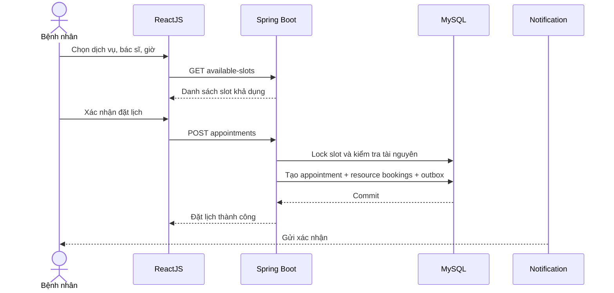
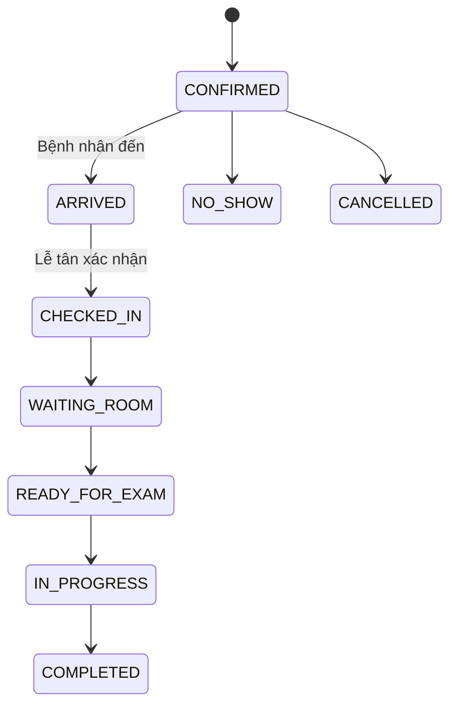

# 03. Luồng nghiệp vụ

## 3.1 Đặt lịch online

## 3.2 Check-in và khám

## 3.3 Đổi lịch

1. Bệnh nhân hoặc lễ tân chọn lịch mới.
2. Hệ thống giữ tài nguyên mới trong transaction.
3. Sau khi giữ thành công, lịch cũ chuyển `RESCHEDULED`.
4. Các reminder cũ bị hủy.
5. Tạo reminder mới.
6. Lưu lịch sử thay đổi và gửi thông báo.

## 3.4 Hủy lịch

1. Kiểm tra quyền hủy và thời hạn hủy.
2. Chuyển trạng thái lịch sang `CANCELLED`.
3. Giải phóng resource booking.
4. Hủy scheduled notifications chưa chạy.
5. Thông báo bệnh nhân và phòng khám.

## 3.5 Walk-in

1. Lễ tân tìm hoặc tạo hồ sơ bệnh nhân.
2. Tạo appointment nguồn `WALK_IN`.
3. Không cần slot online nhưng vẫn phải kiểm tra tài nguyên.
4. Đưa vào queue theo ưu tiên nghiệp vụ.
