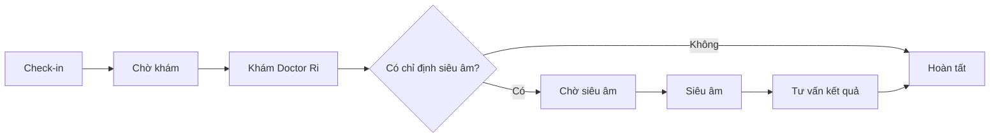

# 05. Hàng đợi và vận hành phòng khám

## 5.1 Appointment và Queue

| Khái niệm | Ý nghĩa |
|---|---|
| Appointment | Cam kết lịch dự kiến |
| Queue | Điều phối thực tế sau khi bệnh nhân đến |
| Encounter | Lần khám thực tế |

## 5.2 Luồng tại phòng khám

## 5.3 Trạng thái queue

- WAITING.
- CALLED.
- READY.
- IN_SERVICE.
- COMPLETED.
- SKIPPED.
- CANCELLED.

## 5.4 Thứ tự ưu tiên

1. Trường hợp được nhân viên y tế đánh dấu cần đánh giá ngay.
2. Bệnh nhân có lịch và đến đúng giờ.
3. Bệnh nhân có lịch và đến sớm.
4. Bệnh nhân đến muộn trong grace period (**15 phút**, cấu hình `late_grace_minutes`).
5. Walk-in (`source = WALK_IN`).

Quyền đổi priority: `RECEPTIONIST`, `CLINIC_ADMIN`, `DOCTOR`.  
Mọi thay đổi ưu tiên phải có `changed_by`, `reason`, `changed_at`.

Quá grace period: **không** auto `NO_SHOW` — lễ tân quyết định no-show hoặc xếp lại.

## 5.5 Phòng đang có bệnh nhân khác

Khi lịch mới đến giờ nhưng phòng chưa trống:

1. Tìm phòng cùng loại đang trống.
2. Nếu có, gán lại phòng và lưu lịch sử.
3. Nếu không, chuyển bệnh nhân sang `WAITING_ROOM`.
4. Cập nhật `estimated_start_at`.
5. Cảnh báo lễ tân.
6. Không tự động hủy lịch.

## 5.6 Các mốc thời gian cần lưu

- `scheduled_start_at`.
- `estimated_start_at`.
- `actual_start_at`.
- `actual_end_at`.
- `checked_in_at`.
- `called_at`.
