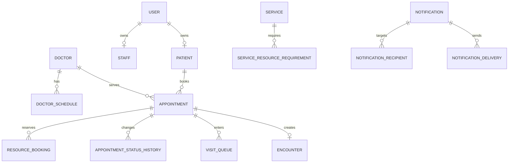

# 07. Domain model và database

## 7.1 Domain chính

## 7.2 Bảng cốt lõi

### users

- id
- email
- phone
- password_hash
- status
- created_at
- updated_at

### patients

- id
- user_id
- patient_code
- full_name
- date_of_birth
- gender
- phone
- email
- emergency_contact_name
- emergency_contact_phone

### doctors

- id
- staff_id
- doctor_code
- specialty_id
- status

### services

- id
- code
- name
- category
- default_duration_minutes
- buffer_before_minutes
- buffer_after_minutes
- booking_policy
- status

### rooms

- id
- clinic_id
- code
- name
- room_type
- status

### equipments

- id
- clinic_id
- code
- name
- equipment_type
- room_id
- status

### appointments

- id
- appointment_code
- patient_id
- clinic_id
- doctor_id
- service_id
- scheduled_start_at
- scheduled_end_at
- estimated_start_at
- actual_start_at
- actual_end_at
- status
- operational_status
- source
- reason
- created_by
- created_at
- updated_at
- version

### resource_bookings

- id
- appointment_id
- resource_type
- resource_id
- start_at
- end_at
- status
- hold_expires_at
- created_at

### visit_queue

- id
- appointment_id
- queue_type
- priority
- queue_number
- status
- assigned_room_id
- checked_in_at
- called_at
- started_at
- completed_at

### encounters

- id
- appointment_id
- patient_id
- doctor_id
- encounter_type
- started_at
- ended_at
- summary

### clinic_settings (MVP)

Key-value / typed settings theo cơ sở — seed từ [15-open-questions.md §15.7](./15-open-questions.md):

- `slot_hold_minutes`, `booking_window_days`, `free_cancel_hours`
- `late_grace_minutes`, `reminder_hours`, `attendance_confirm_enabled`
- `mvp_channels` (default `EMAIL,PUSH`; bật thêm `SMS` khi mở rộng)

## 7.3 Module Sản khoa

### pregnancies

- id
- patient_id
- pregnancy_code
- last_menstrual_period
- estimated_due_date
- pregnancy_status
- risk_level
- assigned_doctor_id

### pregnancy_visits

- id
- pregnancy_id
- appointment_id
- gestational_week
- weight
- blood_pressure
- fetal_heart_rate
- doctor_note
- next_visit_at

## 7.4 Lịch sử trạng thái

`appointment_status_history` phải lưu:

- appointment_id
- old_status
- new_status
- changed_by
- reason
- created_at
