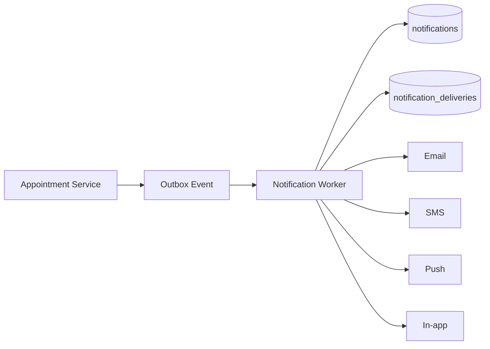

# 09. Thiết kế thông báo

## 9.1 Nguyên tắc

- MySQL là nguồn lưu trữ chính.
- Redis không phải nơi lưu notification lâu dài.
- Một notification nghiệp vụ có thể gửi qua nhiều kênh.
- Không ghi chi tiết bệnh lý nhạy cảm trong push, SMS hoặc email.

## 9.2 Kiến trúc

## 9.3 Bảng dữ liệu

### notifications

- id
- type
- title
- content
- reference_type
- reference_id
- priority
- created_at
- expires_at

### notification_recipients

- id
- notification_id
- recipient_user_id
- is_read
- read_at
- is_archived

### notification_deliveries

- id
- notification_id
- recipient_user_id
- channel
- destination
- status
- provider
- provider_message_id
- attempt_count
- next_retry_at
- sent_at
- delivered_at
- failed_at
- error_code

### notification_preferences

- user_id
- notification_type
- in_app_enabled
- email_enabled
- sms_enabled
- push_enabled
- quiet_hours_start
- quiet_hours_end

### outbox_events

- id
- aggregate_type
- aggregate_id
- event_type
- payload
- status
- retry_count
- available_at
- processed_at

## 9.4 Sự kiện cần hỗ trợ

- APPOINTMENT_CREATED.
- APPOINTMENT_CONFIRMED.
- APPOINTMENT_RESCHEDULED.
- APPOINTMENT_CANCELLED.
- APPOINTMENT_REMINDER_24H.
- APPOINTMENT_REMINDER_2H.
- DOCTOR_UNAVAILABLE.
- ROOM_REALLOCATED.
- EXPECTED_DELAY.
- FOLLOW_UP_REMINDER.

## 9.5 Scheduled notification

Kênh gửi MVP: **Email** (MailHog local) + **Push**. Kế hoạch mở rộng tiếp theo: **SMS**. Zalo sau.  
Bảng `notifications` vẫn lưu bản ghi để portal đọc (in-app inbox). Worker delivery Phase 4 gửi email và push. Chi tiết: [15-open-questions.md](./15-open-questions.md).

Khi tạo lịch:

- Xác nhận: gửi ngay.
- Nhắc 24 giờ: tạo job theo `start_at - 24h` (kèm CTA xác nhận sẽ đến).
- Nhắc 2 giờ: tạo job theo `start_at - 2h`.

Xác nhận sẽ đến (`ATTENDANCE_CONFIRMED`):

- Bật mặc định (`attendance_confirm_enabled = true`).
- Không xác nhận → cảnh báo lễ tân; **không** auto-cancel.

Khi đổi lịch:

- Hủy job cũ.
- Tạo job mới.

Khi hủy lịch:

- Hủy toàn bộ job chưa xử lý.

## 9.6 Retry

- Lần 1: 1 phút.
- Lần 2: 5 phút.
- Lần 3: 15 phút.
- Lần 4: 60 phút.
- Hết retry: chuyển dead-letter trạng thái nghiệp vụ và cảnh báo admin.
