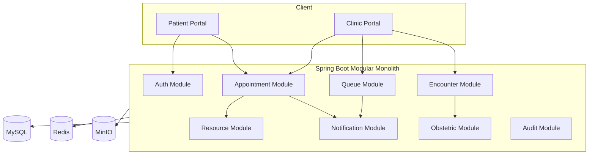

# 10. Kiến trúc hệ thống

## 10.1 Kiến trúc đề xuất

Dùng modular monolith ở giai đoạn đầu.

```text
com.doctorri.clinic
├── auth
├── user
├── patient
├── doctor
├── clinic
├── servicecatalog
├── schedule
├── appointment
├── resource
├── queue
├── encounter
├── obstetric
├── notification
├── audit
└── common
```

## 10.2 Component diagram



## 10.3 Frontend structure

```text
src
├── api
├── app
├── auth
├── components
├── features
│   ├── appointments
│   ├── doctors
│   ├── services
│   ├── queue
│   ├── notifications
│   └── obstetric
├── layouts
├── pages
├── routes
├── store
└── utils
```

## 10.4 Giao tiếp realtime

- WebSocket/SSE dùng cho dashboard lễ tân.
- Database vẫn là nguồn dữ liệu chính.
- Realtime chỉ dùng để cập nhật màn hình nhanh hơn.

## 10.5 Khi nào tách microservice

Chỉ cân nhắc khi:

- Notification có tải lớn.
- Nhiều cơ sở độc lập.
- Cần scale appointment và reporting riêng.
- Có đội vận hành DevOps phù hợp.

Module đầu tiên có thể tách: Notification Service.
