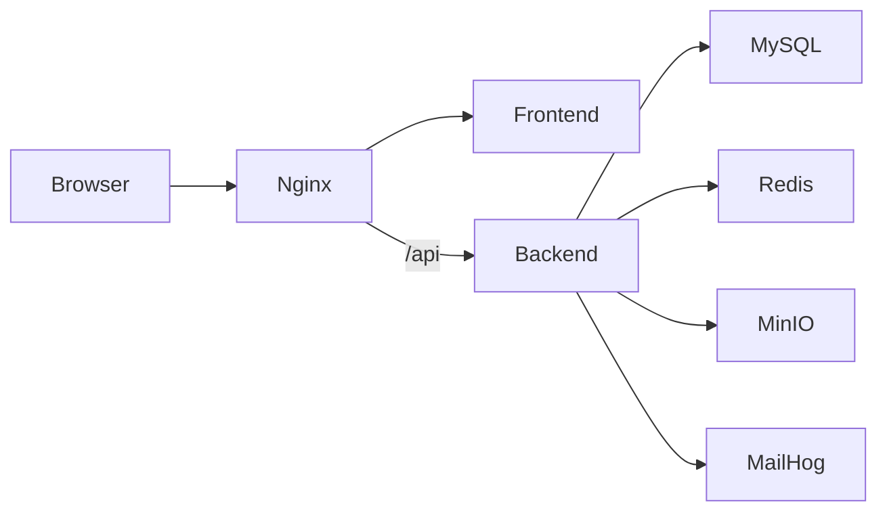

# 12. Deploy local

## 12.1 Docker Compose services

```text
clinic-nginx
clinic-frontend
clinic-backend
clinic-mysql
clinic-redis
clinic-mailhog
clinic-minio
```

## 12.2 Luồng truy cập



## 12.3 Domain local

Thêm vào `/etc/hosts`:

```text
127.0.0.1 doctorri.local
```

Truy cập:

```text
http://doctorri.local
```

## 12.4 Environment variables

```env
SPRING_PROFILES_ACTIVE=docker
DB_HOST=mysql
DB_PORT=3306
DB_NAME=doctorri
DB_USERNAME=doctorri
DB_PASSWORD=doctorri_secret
REDIS_HOST=redis
REDIS_PORT=6379
MINIO_ENDPOINT=http://minio:9000
MAIL_HOST=mailhog
MAIL_PORT=1025
JWT_SECRET=change-me
```

## 12.5 Health checks

- Backend: `/actuator/health`.
- MySQL: `mysqladmin ping`.
- Redis: `redis-cli ping`.
- Frontend/Nginx: HTTP 200.

## 12.6 Migration

- Dùng Flyway.
- Không dùng Hibernate auto create trong production-like local.
- Mỗi thay đổi schema là một file migration.
