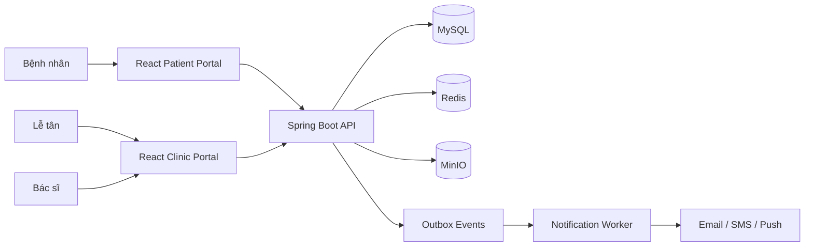

# Doctor Ri Clinic – Product & Technical Specification

Hệ thống đặt lịch và vận hành phòng khám Sản Doctor Ri, ưu tiên khám thai, siêu âm và phụ khoa cơ bản; kiến trúc cho phép mở rộng sang các chuyên khoa khác sau này.

## Mục tiêu

- Cho phép bệnh nhân đặt, đổi, hủy và theo dõi lịch khám.
- Giúp lễ tân điều phối bác sĩ, phòng, thiết bị và hàng đợi thực tế.
- Tránh trùng lịch tài nguyên.
- Lưu thông báo tập trung và hỗ trợ gửi đa kênh.
- Tách lịch hẹn khỏi hàng đợi và lần khám thực tế.
- Hỗ trợ mở rộng sang các dịch vụ y tế khác.

## Bộ tài liệu

1. [01-product-scope.md](./01-product-scope.md) – phạm vi sản phẩm và MVP.
2. [02-actors-and-permissions.md](./02-actors-and-permissions.md) – vai trò và phân quyền.
3. [03-business-workflows.md](./03-business-workflows.md) – luồng nghiệp vụ chính.
4. [04-booking-and-resource-rules.md](./04-booking-and-resource-rules.md) – quy tắc đặt lịch và giữ tài nguyên.
5. [05-queue-and-clinic-operations.md](./05-queue-and-clinic-operations.md) – check-in, hàng đợi và vận hành tại phòng khám.
6. [06-edge-cases.md](./06-edge-cases.md) – các trường hợp ngách và cách xử lý.
7. [07-domain-model-and-database.md](./07-domain-model-and-database.md) – domain model và thiết kế database.
8. [08-api-spec.md](./08-api-spec.md) – REST API đề xuất.
9. [09-notification-design.md](./09-notification-design.md) – lưu trữ và gửi thông báo.
10. [10-system-architecture.md](./10-system-architecture.md) – kiến trúc hệ thống.
11. [11-security-and-audit.md](./11-security-and-audit.md) – bảo mật, dữ liệu nhạy cảm và audit.
12. [12-deployment-local.md](./12-deployment-local.md) – triển khai local bằng Docker.
13. [13-testing-strategy.md](./13-testing-strategy.md) – chiến lược kiểm thử.
14. [14-roadmap.md](./14-roadmap.md) – roadmap phát triển.
15. [15-open-questions.md](./15-open-questions.md) – quyết định nghiệp vụ MVP đã chốt.

## Stack đề xuất

- Backend: Java 21, Spring Boot, Spring Security, Spring Data JPA, Flyway.
- Frontend: ReactJS + TypeScript, React Router, TanStack Query, React Hook Form.
- Database: MySQL.
- Cache/lock: Redis.
- File: MinIO trong local, S3-compatible khi production.
- Email local: MailHog.
- Reverse proxy: Nginx.
- Deploy local: Docker Compose.

## Kiến trúc tổng quát

