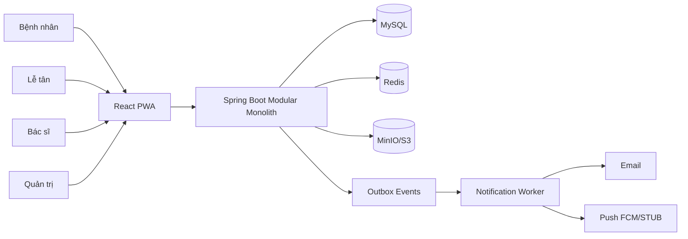

# Doctor Ri Clinic — Project Notes

> Generated overview of the `doctor` workspace (Aug 2026).

---

## What is this project?

**Doctor Ri Clinic** is a full-stack clinic management system for **Doctor Ri Clinic** — an obstetrics & gynecology (OB/GYN) practice in Vietnam, focused initially on **prenatal care, ultrasound, and basic gynecology**.

The workspace is a **multi-repo monorepo-style folder** containing:

| Folder | Role |
|--------|------|
| `doctor-ri-clinic-spec` | Product & technical specification (source of truth) |
| `be-doc-doctor-ri` | Spring Boot backend (modular monolith, Clean Architecture) |
| `fe-doc-doctor-ri` | React frontend (patient + clinic + doctor + admin portals, PWA) |
| `deploy` | Docker Compose (local) + Vercel/Railway deployment configs |
| `scripts` | GitNexus indexing utilities for AI code intelligence |
| `.github` | GitHub tooling (Java upgrade hooks) |
| `AGENTS.md` | Workspace-level AI context routing + GitNexus index map |

### Core goals

- Let **patients** book, reschedule, cancel, and track appointments; receive reminders.
- Let **receptionists** check in patients, manage queues, assign rooms, handle walk-ins.
- Let **doctors** view schedules, manage their queue, start/complete exams.
- Let **admins** manage services, doctors, schedules, and audit logs.
- **Prevent double-booking** of doctors, rooms, and ultrasound equipment (with buffer times).
- **Separate** appointment scheduling from real-time queue and actual encounters.
- Support **obstetric module** (pregnancies, visits) as a domain extension.

### Out of MVP scope

Online payments, health insurance, full EMR, PACS/DICOM, national e-prescriptions, external lab integration, telemedicine.

---

## Workspace layout

```
doctor/
├── AGENTS.md                  # AI workspace map + GitNexus repo index
├── notes.md                   # This file
├── be-doc-doctor-ri/          # Backend (Java/Spring Boot) — separate git repo
├── fe-doc-doctor-ri/          # Frontend (React/TypeScript) — separate git repo
├── doctor-ri-clinic-spec/     # Spec docs — separate git repo
├── deploy/                    # Docker Compose + cloud deploy templates
├── scripts/                   # gitnexus-index-all.sh
└── .github/                   # modernize/java-upgrade hooks
```

Each of the three main code/spec folders is an **independent git repository**, indexed separately by GitNexus.

---

## Folder: `doctor-ri-clinic-spec/`

**Purpose:** Product and technical specification — the business and design source of truth.

**GitNexus repo name:** `doctor-ri-clinic-spec`

### Document index (15 files)

| File | Topic |
|------|-------|
| `01-product-scope.md` | MVP scope, target users, priority services, extensibility principles |
| `02-actors-and-permissions.md` | Roles (PATIENT, RECEPTIONIST, DOCTOR, NURSE, CLINIC_ADMIN, SYSTEM_ADMIN) + RBAC matrix |
| `03-business-workflows.md` | Online booking, check-in/exam flow, reschedule, walk-in sequences |
| `04-booking-and-resource-rules.md` | Resource locking (doctor, room, ultrasound machine), buffer rules, slot hold |
| `05-queue-and-clinic-operations.md` | Appointment vs queue vs encounter; queue states; clinic floor flow |
| `06-edge-cases.md` | Late/early arrivals, no-shows, conflicts, concurrent booking |
| `07-domain-model-and-database.md` | ER diagram, core tables (users, patients, appointments, resources, notifications…) |
| `08-api-spec.md` | REST API under `/api/v1` — auth, services, slots, appointments, reception, queue, doctor, admin |
| `09-notification-design.md` | Outbox pattern, multi-channel (EMAIL, PUSH, future SMS), inbox, reminders |
| `10-system-architecture.md` | Modular monolith modules, component diagram, frontend structure, when to split microservices |
| `11-security-and-audit.md` | JWT, sensitive data, audit logging |
| `12-deployment-local.md` | Local Docker deployment notes |
| `13-testing-strategy.md` | Unit, integration, concurrency testing approach |
| `14-roadmap.md` | 6-phase roadmap (Foundation → Appointment → Clinic ops → Notification → Obstetric → Hardening) |
| `15-open-questions.md` | Resolved MVP business decisions |

### Recommended stack (from spec)

- **Backend:** Java 21, Spring Boot, Spring Security, JPA, Flyway
- **Frontend:** React + TypeScript, React Router, TanStack Query, React Hook Form
- **Database:** MySQL
- **Cache/lock:** Redis
- **Files:** MinIO (local) / S3-compatible (prod)
- **Email (local):** MailHog
- **Deploy:** Docker Compose, Nginx reverse proxy

### Priority services

- First prenatal visit
- Routine prenatal checkups
- Fetal ultrasound
- Results consultation
- Basic gynecology

---

## Folder: `be-doc-doctor-ri/`

**Purpose:** Full MVP backend — modular monolith Spring Boot with Clean Architecture.

**GitNexus repo name:** `be-doc-doctor-ri` (~1986 symbols, 5706 relationships)

### Tech stack

| Item | Value |
|------|-------|
| Java | 20+ |
| Spring Boot | 3.4.1 |
| Build | Maven (`pom.xml`) |
| DB migrations | Flyway V1–V5 |
| Auth | JWT access + refresh, RBAC |
| Cache | Redis (slot hold, idempotency) |
| Push | FCM (optional) or STUB |
| Tests | Unit + Testcontainers integration/concurrency tests |

### Package structure (`com.doctorri.clinic.*`)

Each module follows Clean Architecture layers: `domain` → `application` → `infrastructure` → `presentation`.

| Module | Responsibility |
|--------|----------------|
| `auth` | Login, register, JWT, refresh, logout |
| `user` | User accounts |
| `patient` | Patient profiles (`GET/PUT /api/v1/me/profile`) |
| `doctor` | Doctor entities and APIs |
| `clinic` | Clinic/reception operations |
| `servicecatalog` | Medical services catalog |
| `schedule` | Doctor schedules, slot generation |
| `appointment` | Create, confirm, cancel, reschedule; idempotency; Redis slot hold |
| `resource` | Doctor/room/ultrasound machine booking with buffers |
| `queue` | Call, start, complete, reprioritize; realtime hooks |
| `encounter` | Actual exam sessions |
| `obstetric` | Pregnancies + visits |
| `notification` | Outbox worker → EMAIL + PUSH; inbox APIs; 24h/2h reminders |
| `result` | Service results / result media (Flyway V5) |
| `audit` | Audit logging |
| `admin` | CRUD for services, doctors, schedules |
| `shared` | Common config, MinIO, outbox, Redis, security, seed data |

### Database migrations

- `V1__init_schema_and_seed.sql` — schema + demo seed data
- `V2__operations_full.sql` — clinic operations tables
- `V3__doctor_schedule_and_services.sql` — schedules + doctor-service mapping
- `V4__fix_schedule_day_of_week_type.sql` — schedule fix
- `V5__service_content_and_result_media.sql` — results/media

### Implemented features (MVP)

- JWT + RBAC for all roles
- Services / Doctors / Slots (with before/after buffer)
- Appointments with `Idempotency-Key` header
- Redis slot hold + resource booking
- Reception: create, check-in, assign-room, no-show, walk-in (`?walkIn=true`)
- Queue management (call / start / complete / reprioritize)
- Doctor: schedule, queue, start/complete exam, activities
- Notification outbox → EMAIL + PUSH (push stub or FCM)
- Reminder outbox `APPOINTMENT_REMINDER_24H` / `_2H`
- Obstetric: pregnancies + visits
- Admin CRUD endpoints
- Health: `/actuator/health`

### Demo accounts (password: `Password123!`)

| Email | Role |
|-------|------|
| `mebau@doctorri.local` | PATIENT |
| `receptionist@doctorri.local` | RECEPTIONIST |
| `doctor.ri@doctorri.local` | DOCTOR (DR-RI) |
| `admin@doctorri.local` | CLINIC_ADMIN |

### How to run locally

```bash
# Requires JDK 20+, MySQL (db_clinic), Redis
mvn test
mvn spring-boot:run
# Health: http://localhost:8080/actuator/health
```

### Other files

- `Dockerfile` — Temurin JDK 20, used by Docker Compose and Railway
- `docs/adr/` — Architecture Decision Records
- `.gitnexus/` — GitNexus code intelligence index

---

## Folder: `fe-doc-doctor-ri/`

**Purpose:** React frontend — **Patient Portal** for expectant mothers, plus clinic, doctor, and admin UIs.

**GitNexus repo name:** `fe-doc-doctor-ri` (~570 symbols, 1169 relationships)

### Tech stack

| Item | Value |
|------|-------|
| React | 18 |
| TypeScript | ~5.6 |
| Build | Vite 6 |
| Routing | React Router 7 |
| Data fetching | TanStack Query 5 |
| Forms | React Hook Form |
| Tests | Vitest + Testing Library |
| PWA | vite-plugin-pwa (Add to Home Screen) |

### Design

- **Theme:** Sage/blush palette
- **Fonts:** Fraunces + Nunito
- **Target UX:** Mobile-friendly PWA for pregnant patients

### Source structure

```
src/
├── app/              # Composition root (providers, router, styles)
├── pages/            # Route entry points by role
│   ├── auth/         # Login, register
│   ├── patient/      # Home, services, book, appointments, results, notifications, settings, profile
│   ├── clinic/       # Queue board, walk-in
│   ├── doctor/       # Schedule, queue
│   └── admin/        # Services, doctors, audit
├── features/         # Bounded features (Clean Architecture per feature)
│   ├── auth, appointments, doctors, services, schedule, queue, encounter
│   ├── obstetric, notifications, patients, clinic, admin, results, doctor-portal
│   └── each: domain / application / infrastructure / ui
├── entities/         # Shared domain models (appointment, doctor, patient, service, user)
├── widgets/          # Layouts + queue-board, appointment-calendar
└── shared/           # api, config, hooks, i18n, lib, types, ui
```

### Dependency rules

```
pages → features/ui → features/application → features/domain
                  ↘ features/infrastructure → shared/api → Backend /api/v1
```

- No direct `fetch` in `ui` or `pages`
- No cross-import between features (use `entities` / `shared`)

### Routes (from `AppRouter.tsx`)

| Path | Role | Page |
|------|------|------|
| `/` | Public | Landing |
| `/auth/login`, `/auth/register` | Public | Auth |
| `/patient/*` | PATIENT | Home, services, book, appointments, results, notifications, settings, profile |
| `/clinic/*` | RECEPTIONIST, NURSE, CLINIC_ADMIN, SYSTEM_ADMIN | Queue, walk-in |
| `/doctor/*` | DOCTOR, CLINIC_ADMIN, SYSTEM_ADMIN | Schedule, queue |
| `/admin/*` | CLINIC_ADMIN, SYSTEM_ADMIN | Home, services, doctors, audit |

### How to run locally

```bash
npm install
npm test
npm run build
npm run dev   # http://127.0.0.1:5173 — Vite proxies /api → :8080
```

Demo login: `mebau@doctorri.local` / `Password123!`

### PWA

Supports **Add to Home Screen** on iPhone/Android. Build with `npm run build && npm run preview -- --host`.

### Other files

- `vercel.json` — SPA rewrites for Vercel deployment
- `nginx.conf` — Used in Docker FE container
- `docs/adr/001-feature-clean-architecture.md` — Frontend architecture ADR
- `.env.example` — `VITE_API_BASE_URL` and related vars

---

## Folder: `deploy/`

**Purpose:** Local full-stack Docker setup and cloud deployment guides.

### Local (Docker Compose)

File: `deploy/docker-compose.yml`

| Service | Container | Host port (default) | Notes |
|---------|-----------|---------------------|-------|
| `web` | nginx + built FE | **8088** | Proxies `/api` → `api` |
| `api` | Spring Boot BE | 8080 | Built from `be-doc-doctor-ri/Dockerfile` |
| `mysql` | MySQL 8 | 3307 | DB: `db_clinic` |
| `redis` | Redis 7 | 6380 | Required for slot hold |

**Quick start:**

```bash
cd deploy
cp -n .env.example .env
docker compose up -d --build
# Open http://localhost:8088
```

See `deploy/LOCAL.md` for Mac-specific notes and demo accounts.

### Cloud deployment

| Layer | Platform | Config location |
|-------|----------|-----------------|
| Frontend | **Vercel** | `fe-doc-doctor-ri/vercel.json`, `deploy/vercel/.env.example` |
| Backend | **Railway** | `be-doc-doctor-ri/Dockerfile`, `deploy/railway/` |
| MySQL | Railway plugin | `deploy/railway/.env.mysql-redis.example` |
| Redis | Railway plugin | Required |

**Key env vars (BE):** `MYSQL_*`, `REDIS_*`, `JWT_SECRET`, `CORS_ALLOWED_ORIGINS`, optional `PUSH_PROVIDER`

**Key env vars (FE):** `VITE_API_BASE_URL=https://<be-host>/api/v1`

See `deploy/README.md` for full smoke-test checklist.

---

## Folder: `scripts/`

**Purpose:** GitNexus indexing for AI-assisted development.

| File | Description |
|------|-------------|
| `gitnexus-index-all.sh` | Indexes all child git repos under the workspace for GitNexus code intelligence |

Usage examples:

```bash
./scripts/gitnexus-index-all.sh --status
./scripts/gitnexus-index-all.sh --only be-doc-doctor-ri,fe-doc-doctor-ri
./scripts/gitnexus-index-all.sh --force
```

---

## Folder: `.github/`

**Purpose:** GitHub-related tooling (minimal in this workspace).

| Path | Description |
|------|-------------|
| `.github/modernize/java-upgrade/` | Java upgrade automation hooks (`recordToolUse.ps1`, `recordToolUse.sh`) |

---

## Root: `AGENTS.md`

**Purpose:** AI agent context routing for the workspace.

- Maps each child repo to its GitNexus name
- Documents how to use GitNexus MCP tools for code exploration and impact analysis
- Note: Contains legacy CTFX (forex trading) routing content from a template — the **Doctor Ri–specific** section lists the three repos: `be-doc-doctor-ri`, `fe-doc-doctor-ri`, `doctor-ri-clinic-spec`

---

## Architecture overview



### Key design decisions

1. **Modular monolith** — not microservices yet; notification service is first candidate to split later.
2. **Appointment ≠ Queue ≠ Encounter** — scheduling is separate from floor operations and actual exams.
3. **Resource-aware booking** — doctor + room + ultrasound machine with buffer times, Redis slot holds.
4. **Outbox pattern** — reliable notifications and reminders (24h, 2h before appointment).
5. **Extensible by service config** — OB/GYN is first specialty; core booking is not hard-coded to obstetrics.
6. **Clean Architecture** — both BE (Java packages) and FE (feature folders) follow layered boundaries.

---

## Development roadmap status (from spec Phase 1–6)

| Phase | Focus | Status (from READMEs) |
|-------|-------|----------------------|
| 1 | Foundation (auth, users, Docker) | Done |
| 2 | Appointment core (slots, resources, anti double-book) | Done |
| 3 | Clinic ops (check-in, queue, rooms) | Done |
| 4 | Notifications (outbox, email, push stub/FCM, reminders) | Done |
| 5 | Obstetric module (pregnancy, visits) | Done |
| 6 | Hardening (audit, security, perf, monitoring) | Partial / ongoing |

---

## Quick reference

| Task | Command / URL |
|------|---------------|
| Full stack (Docker) | `cd deploy && docker compose up -d --build` → http://localhost:8088 |
| BE only | `cd be-doc-doctor-ri && mvn spring-boot:run` → :8080 |
| FE only | `cd fe-doc-doctor-ri && npm run dev` → :5173 |
| BE health | `GET /actuator/health` |
| API base | `/api/v1` |
| Spec source | `doctor-ri-clinic-spec/` |
| Patient demo | `mebau@doctorri.local` / `Password123!` |
